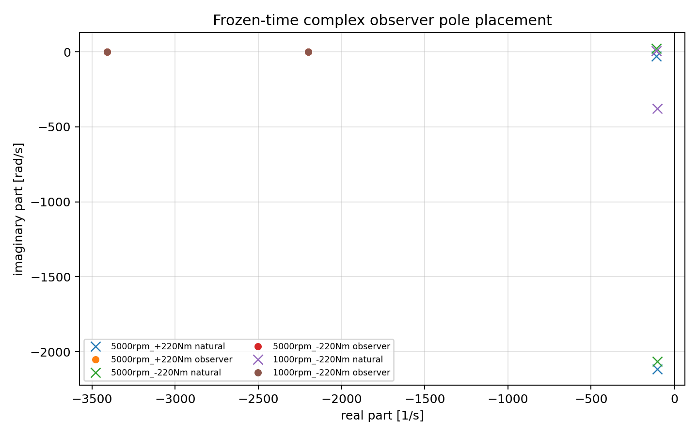
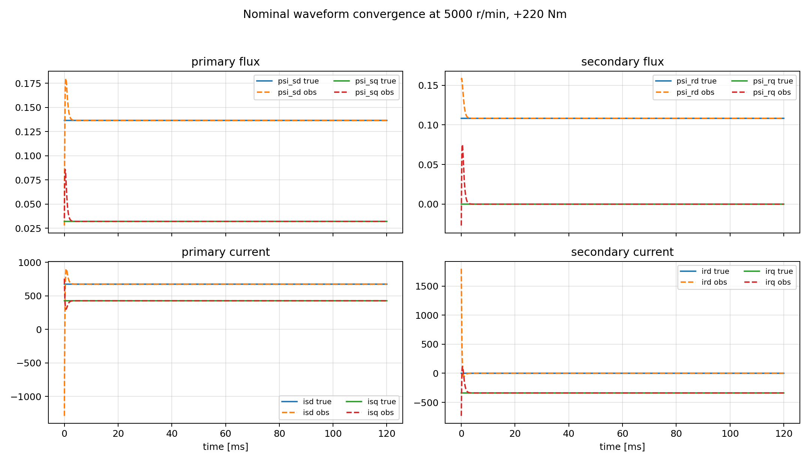
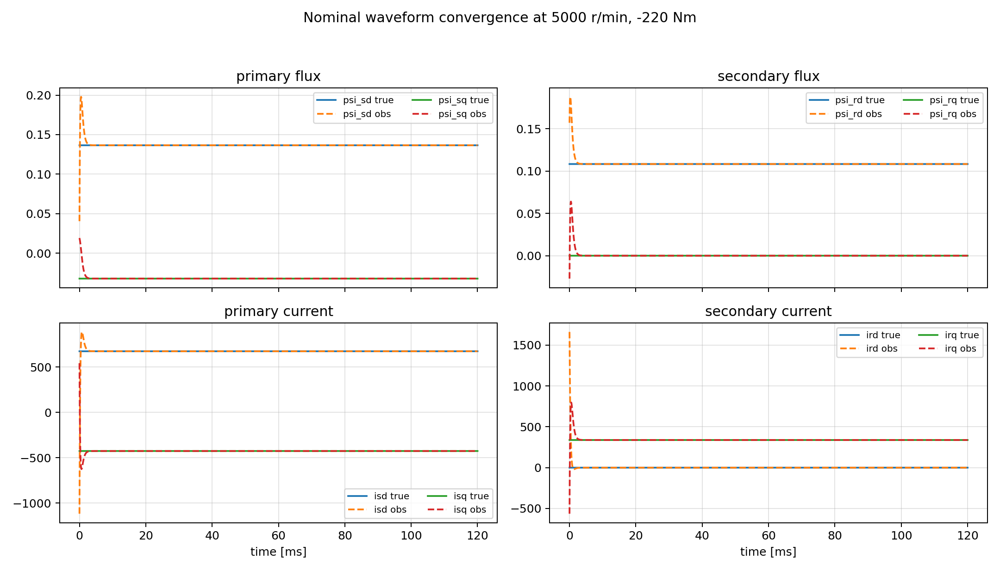
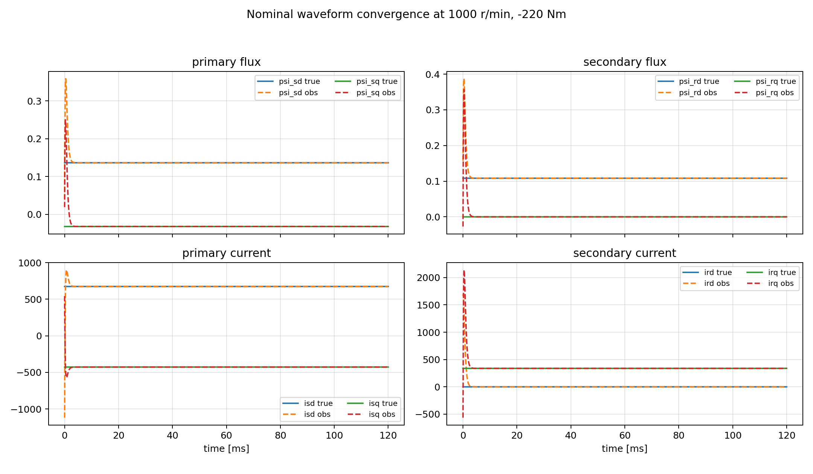
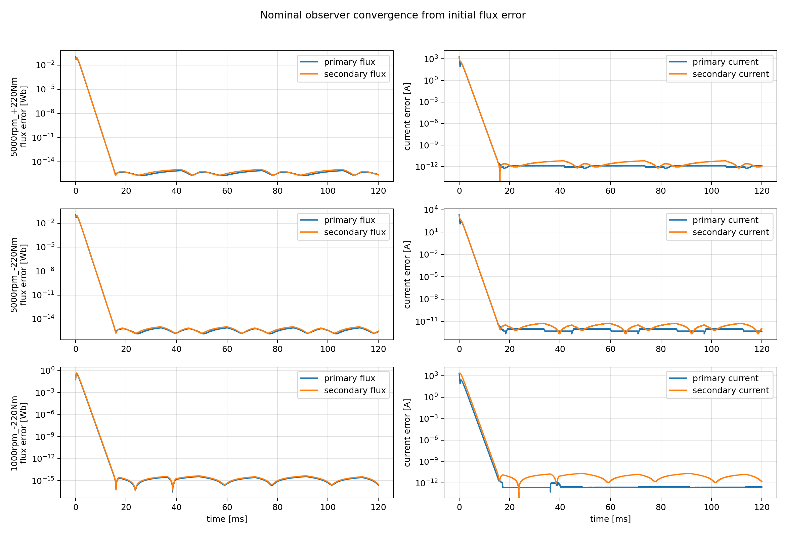
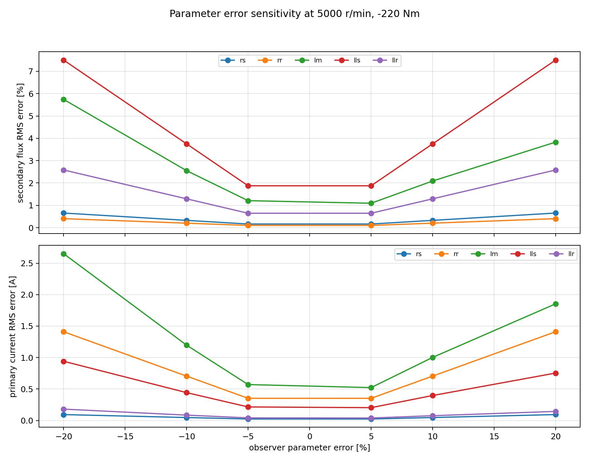
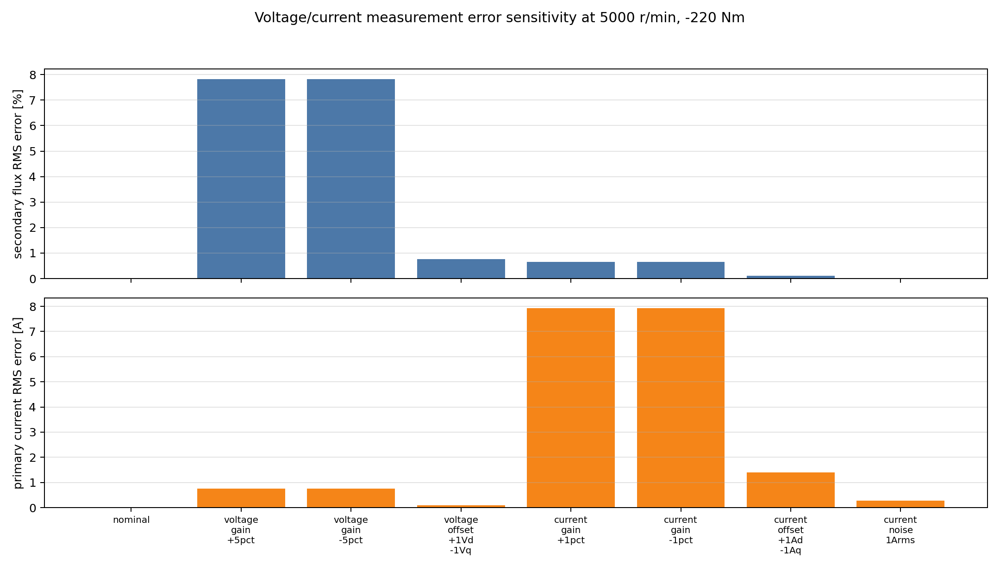

# 回転dq座標フルオーダ磁束オブザーバ設計・評価

本資料は、指定された誘導機定数を用いて、回転dq座標上のフルオーダ磁束オブザーバを設計し、推定一次磁束・二次磁束、および出力一次電流・二次電流が真値へ収束することを確認した結果をまとめたものである。オブザーバゲインは実数4状態の行列 \(H\) として扱い、極配置法でオンライン計算する。

使用した誘導機定数は以下である。

| 記号 | 値 | 説明 |
|---|---:|---|
| \(R_s\) | \(0.00762\ \Omega\) | 一次抵抗 |
| \(R_r\) | \(0.008041\ \Omega\) | 二次抵抗 |
| \(L_{ls}\) | \(0.0000419\ \mathrm{H}\) | 一次漏れインダクタンス |
| \(L_{lr}\) | \(0.0000419\ \mathrm{H}\) | 二次漏れインダクタンス |
| \(M=L_m\) | \(0.0001608\ \mathrm{H}\) | 相互インダクタンス |
| \(p\) | \(4\) | 極対数 |

合成インダクタンスは

$$
L_s = L_{ls}+M,\qquad L_r=L_{lr}+M,\qquad D=L_sL_r-M^2
$$

である。

## 1. 概要

目的は、一次電圧、一次電流、回転速度、およびdq座標の回転角速度から、一次磁束と二次磁束を推定することである。オブザーバの状態変数は実数4状態

$$
x_R=
\begin{bmatrix}
\psi_{sd} & \psi_{sq} & \psi_{rd} & \psi_{rq}
\end{bmatrix}^T
$$

とする。測定出力は一次電流

$$
y_R=
\begin{bmatrix}
i_{sd} & i_{sq}
\end{bmatrix}^T
$$

であり、これを補正入力に使う。二次電流は直接測定しないが、推定磁束からオブザーバ出力として計算する。

評価条件は以下とした。

| 条件 | 速度 | トルク | \(i_{sd}\) | \(i_{sq}\) | \(\omega_{\mathrm{slip}}\) |
|---|---:|---:|---:|---:|---:|
| 力行高速 | \(5000\ \mathrm{r/min}\) | \(+220\ \mathrm{Nm}\) | \(673.610\ \mathrm{A}\) | \(+426.722\ \mathrm{A}\) | \(+25.130\ \mathrm{rad/s}\) |
| 回生高速 | \(5000\ \mathrm{r/min}\) | \(-220\ \mathrm{Nm}\) | \(673.610\ \mathrm{A}\) | \(-426.722\ \mathrm{A}\) | \(-25.130\ \mathrm{rad/s}\) |
| 回生低速 | \(1000\ \mathrm{r/min}\) | \(-220\ \mathrm{Nm}\) | \(673.610\ \mathrm{A}\) | \(-426.722\ \mathrm{A}\) | \(-25.130\ \mathrm{rad/s}\) |

dq座標の回転角速度は指定どおり

$$
\omega_k=p\omega_m+\omega_{\mathrm{slip}}
$$

とした。

実装と評価は [scripts/run_flux_observer_evaluation.py](scripts/run_flux_observer_evaluation.py) にまとめている。PDF版は [flux_observer_design_report.pdf](flux_observer_design_report.pdf) に出力した。

## 2. 磁束オブザーバの構成

### 2.1 電流と磁束の関係

一次磁束ベクトル、二次磁束ベクトル、一次電流ベクトル、二次電流ベクトルを

$$
\psi_s=
\begin{bmatrix}
\psi_{sd}\\
\psi_{sq}
\end{bmatrix},\quad
\psi_r=
\begin{bmatrix}
\psi_{rd}\\
\psi_{rq}
\end{bmatrix},\quad
i_s=
\begin{bmatrix}
i_{sd}\\
i_{sq}
\end{bmatrix},\quad
i_r=
\begin{bmatrix}
i_{rd}\\
i_{rq}
\end{bmatrix}
$$

とする。d軸・q軸それぞれで、磁束と電流は

$$
\begin{bmatrix}
\psi_s\\
\psi_r
\end{bmatrix}
=
\begin{bmatrix}
L_s I_2 & M I_2\\
M I_2 & L_r I_2
\end{bmatrix}
\begin{bmatrix}
i_s\\
i_r
\end{bmatrix}
$$

を満たす。したがって、磁束から電流を計算する式は

$$
i_s = \frac{L_r\psi_s-M\psi_r}{D}
$$

$$
i_r = \frac{-M\psi_s+L_s\psi_r}{D}
$$

である。オブザーバでは、この式を用いて推定一次電流と推定二次電流を出力する。

### 2.2 回転dq座標の状態方程式

以下の90度回転行列を定義する。

$$
J=
\begin{bmatrix}
0 & -1\\
1 & 0
\end{bmatrix}
$$

一次電圧を \(v_s=[v_{sd}\ v_{sq}]^T\)、二次電圧を短絡として \(v_r=0\) とする。回転dq座標の状態方程式は

$$
\dot{\psi}_s
=
v_s
-R_s i_s
-\omega_k J\psi_s
$$

$$
\dot{\psi}_r
=
-R_r i_r
-(\omega_k-\omega_r)J\psi_r
$$

である。ここで

$$
\omega_r=p\omega_m
$$

は電気角のロータ速度である。

電流式を代入すると、実数4状態の状態方程式

$$
\dot{x}_R=A_Rx_R+B_Rv_s
$$

となる。ただし、

$$
A_R=
\begin{bmatrix}
-\frac{R_sL_r}{D}I_2-\omega_kJ & \frac{R_sM}{D}I_2\\
\frac{R_rM}{D}I_2 & -\frac{R_rL_s}{D}I_2-(\omega_k-\omega_r)J
\end{bmatrix}
$$

$$
B_R=
\begin{bmatrix}
I_2\\
0_{2\times2}
\end{bmatrix}
$$

である。一次電流出力は

$$
y_R=C_Rx_R
$$

$$
C_R=
\begin{bmatrix}
\frac{L_r}{D}I_2 & -\frac{M}{D}I_2
\end{bmatrix}
$$

である。二次電流出力は

$$
i_r=C_{r,R}x_R
$$

$$
C_{r,R}=
\begin{bmatrix}
-\frac{M}{D}I_2 & \frac{L_s}{D}I_2
\end{bmatrix}
$$

で計算する。

### 2.3 オブザーバ式

本資料で用いるオブザーバは

$$
\dot{\hat{x}}_R
=
A_{R,o}\hat{x}_R
+B_{R,o}v_{s,m}
+H\left(y_{R,m}-C_{R,o}\hat{x}_R\right)
$$

である。ここで、オブザーバゲインは

$$
H\in\mathbb{R}^{4\times2}
$$

である。添字 \(o\) はオブザーバ内部で使用する定数を表し、添字 \(m\) は測定値を表す。定数誤差評価では \(A_{R,o},B_{R,o},C_{R,o}\) に誤差付き定数を使用し、真値モデルには基準定数を使用した。

今回の誘導機モデルはd軸/q軸で同じ抵抗・インダクタンスを持つため、実装では次の回転対称な実数行列構造を採用する。

$$
H=
\begin{bmatrix}
G_0 & -G_1\\
G_1 & G_0\\
G_2 & -G_3\\
G_3 & G_2
\end{bmatrix}
$$

ここで未知数は \(G_0,G_1,G_2,G_3\) の4つである。d軸/q軸で非対称な飽和やセンサ特性を入れる場合は、この構造に制限せず、一般の実数 \(4\times2\) ゲイン \(H\) を直接設計する。

## 3. オブザーバゲイン設計法

オブザーバゲイン \(H\) は、各制御周期で現在の \(\omega_r,\omega_k\) を用いて \(A_{R,o}\) を更新し、極配置法によりオンライン計算する。

### 3.1 極配置法によるオブザーバ設計の基本原理

連続時間の線形状態方程式を

$$
\dot{x}=Ax+Bu
$$

$$
y=Cx
$$

とする。ここで \(x\) は状態、\(u\) は既知入力、\(y\) は測定出力である。Luenberger型オブザーバは

$$
\dot{\hat{x}}=A\hat{x}+Bu+H(y-C\hat{x})
$$

で与えられる。推定誤差を

$$
\tilde{x}=x-\hat{x}
$$

と定義する。誤差方程式は、この定義を時間微分して

$$
\dot{\tilde{x}}=\dot{x}-\dot{\hat{x}}
$$

と書くところから導出する。まず、真値モデルは

$$
\dot{x}=Ax+Bu
$$

である。一方、オブザーバは

$$
\dot{\hat{x}}=A\hat{x}+Bu+H(y-C\hat{x})
$$

である。これらを \(\dot{\tilde{x}}=\dot{x}-\dot{\hat{x}}\) に代入すると、

$$
\begin{aligned}
\dot{\tilde{x}}
&=(Ax+Bu)-\{A\hat{x}+Bu+H(y-C\hat{x})\}\\
&=A(x-\hat{x})-H(y-C\hat{x})
\end{aligned}
$$

となる。ここで、真値モデルとオブザーバに同じ入力 \(u\) を入れているため、\(Bu\) は差し引きで消える。

さらに、測定出力は \(y=Cx\) なので、測定値と推定出力の差は

$$
y-C\hat{x}=Cx-C\hat{x}=C(x-\hat{x})=C\tilde{x}
$$

である。したがって、

$$
\begin{aligned}
\dot{\tilde{x}}
&=A\tilde{x}-HC\tilde{x}\\
&=(A-HC)\tilde{x}
\end{aligned}
$$

となる。これがオブザーバの誤差方程式である。したがって、オブザーバの収束速度と振動性は、閉じた誤差行列

$$
A_H=A-HC
$$

の固有値で決まる。極配置法とは、この \(A_H\) の固有値が設計者の指定した極

$$
p_1,p_2,\ldots,p_n
$$

になるように \(H\) を選ぶ方法である。

指定極を配置できる条件は、対 \((A,C)\) が可観測であることである。状態次数を \(n\) とすると、可観測行列

$$
\mathcal{O}=
\begin{bmatrix}
C\\
CA\\
CA^2\\
\vdots\\
CA^{n-1}
\end{bmatrix}
$$

が

$$
\operatorname{rank}(\mathcal{O})=n
$$

を満たせば、理論上は任意の安定極を \(A-HC\) に配置できる。直感的には、測定出力 \(y\) に全状態を推定するだけの情報が含まれていれば、出力誤差 \(y-C\hat{x}\) を使って推定誤差を任意の減衰速度で戻せる、という意味である。

状態フィードバックや `place` の話は、オブザーバの構造を理解するために必須ではなく、一般的な計算方法を説明するための補足である。

状態フィードバックでは、状態 \(x\) を測定できると仮定し、入力を

$$
u=-Kx
$$

のように返す。このとき閉ループの状態方程式は

$$
\dot{x}=(A-BK)x
$$

となる。ここで \(K\) を選ぶと、\(A-BK\) の極を動かせる。

オブザーバでは、推定誤差の式が

$$
\dot{\tilde{x}}=(A-HC)\tilde{x}
$$

である。形だけを見ると、状態フィードバックの \(A-BK\) と、オブザーバの \(A-HC\) はよく似ている。違いは、状態フィードバックでは入力行列 \(B\) とゲイン \(K\) が出てくるのに対し、オブザーバでは出力行列 \(C\) とゲイン \(H\) が出てくる点である。

この対応関係を使うと、状態フィードバック用の極配置計算と同じアルゴリズムで、オブザーバゲインも計算できる。この対応を制御理論では双対性と呼ぶ。MATLABの `place(A', C', poles)'` は、その双対性を使ってオブザーバゲインを計算する書き方である。

ただし、本資料のPython実装およびC実装では、汎用の `place` 関数は使っていない。2.3節の回転対称な実数4状態ゲイン構造を保つため、3.3節で示す4元連立一次方程式を直接解いて \(H\) を求める。したがって、本設計を再現するうえで重要なのは `place` の式ではなく、3.3節の \(G_0,G_1,G_2,G_3\) を解く式である。

目標極は必ず左半平面に置く。極の実部が負であれば推定誤差は減衰し、実部の絶対値を大きくすると収束は速くなる。一方で、極を速くしすぎると電流ノイズや電圧誤差を強く拾い、離散化誤差にも敏感になる。したがって、極配置は単に速い極を選べばよいのではなく、推定遅れ、ノイズ感度、サンプリング周期、モデル誤差のトレードオフで決める。

### 3.2 今回の目標極の選定根拠

目標極を

$$
p_1=-\omega_o,\qquad p_2=-1.55\omega_o
$$

とした。本評価では、電流制御帯域 \(\omega_{cc}=1000\ \mathrm{rad/s}\) に対して約2.2倍の観測帯域として

$$
\omega_o=2200\ \mathrm{rad/s}
$$

を用いた。第2極は重根を避け、数値条件と応答分離を確保するため \(p_2=1.55p_1\) とした。この値は一意の最適値ではなく、ノイズ感度、推定遅れ、離散化余裕のトレードオフに基づく設計例である。目標極は

$$
p_1=-2200,\qquad p_2=-3410
$$

である。

制御周期を \(T_s=100\ \mu\mathrm{s}\) とすると、最速極 \(3410\ \mathrm{rad/s}\) はサンプリング角周波数 \(2\pi/T_s=62832\ \mathrm{rad/s}\) の約5.4%であり、離散化に対して十分な余裕を持つ。

閉じたオブザーバ誤差行列は

$$
A_H=A_{R,o}-HC_{R,o}
$$

である。実数4状態表現では、今回の実数目標極に対して

$$
\lambda(A_H)=\{p_1,p_1,p_2,p_2\}
$$

となるように \(H\) を決定する。

### 3.3 今回の実数4状態ゲイン \(H\) の計算法

実装では、2.3節の構造を持つ \(H\) を各サンプルで直接計算する。以下の2次元回転対称ブロック

$$
X=x_0I_2+x_1J
$$

を係数対

$$
X\leftrightarrow \langle x_0,x_1\rangle
$$

で表す。この表記は実数 \(2\times2\) 行列の省略表記であり、ゲインを別記号に置き換えるものではない。積は

$$
\langle a,b\rangle\langle c,d\rangle
=\langle ac-bd,\ ad+bc\rangle
$$

で計算できる。

オブザーバ内部モデルの各ブロックを

$$
A_{00}=\left\langle -\frac{R_sL_r}{D},\ -\omega_k\right\rangle,
\quad
A_{01}=\left\langle \frac{R_sM}{D},\ 0\right\rangle
$$

$$
A_{10}=\left\langle \frac{R_rM}{D},\ 0\right\rangle,
\quad
A_{11}=\left\langle -\frac{R_rL_s}{D},\ -(\omega_k-\omega_r)\right\rangle
$$

とし、

$$
c_0=\frac{L_r}{D},\qquad c_1=-\frac{M}{D}
$$

とおく。ブロック行列

$$
A_b=
\begin{bmatrix}
A_{00} & A_{01}\\
A_{10} & A_{11}
\end{bmatrix}
$$

について、

一般的な2次系の極配置導出では、行列の対角成分の和であるトレースを用いることが多い。トレースは通常 `tr` と略記され、

$$
\operatorname{tr}(A)=\sum_i A_{ii}
$$

で定義される。2次系では特性多項式の係数が「対角和」と「行列式」で決まるため、目標極との関係を

$$
\operatorname{tr}(A_H)=p_1+p_2
$$

$$
\det(A_H)=p_1p_2
$$

のように書ける。

ただし、本資料の実装式では `tr` という省略記号が時間や別変数と紛らわしいため、トレース記号を主式では使わない。代わりに、対角ブロックの和を

$$
\langle T_0,T_1\rangle=A_{00}+A_{11}
$$

と明示的に定義する。つまり、\(T_0\) は対角ブロック和の \(I_2\) 係数、\(T_1\) は対角ブロック和の \(J\) 係数であり、トレース条件を実数ブロック成分へ展開した量である。同様に、行列式に相当する量も

$$
\langle \Delta_0,\Delta_1\rangle=A_{00}A_{11}-A_{01}A_{10}
$$

として先に成分で定義する。

この書き方により、設計条件は「対角和を目標極の和に合わせる」「行列式を目標極の積に合わせる」という極配置法そのものを保ったまま、C実装と同じ実数4元連立一次方程式として表現できる。

補助的に、次の隣接行列

$$
\operatorname{adj}(A_b)=
\begin{bmatrix}
A_{11} & -A_{01}\\
-A_{10} & A_{00}
\end{bmatrix}
$$

を定義する。さらに

$$
\langle r_{20,0},r_{20,1}\rangle=c_0A_{11}-c_1A_{10}
$$

$$
\langle r_{21,0},r_{21,1}\rangle=-c_0A_{01}+c_1A_{00}
$$

とする。

閉じた誤差行列の特性を \(p_1,p_2\) に合わせる条件は、\(G_0,G_1,G_2,G_3\) に関する次の4元連立一次方程式になる。

$$
\begin{bmatrix}
c_0 & 0 & c_1 & 0\\
0 & c_0 & 0 & c_1\\
r_{20,0} & -r_{20,1} & r_{21,0} & -r_{21,1}\\
r_{20,1} & r_{20,0} & r_{21,1} & r_{21,0}
\end{bmatrix}
\begin{bmatrix}
G_0\\G_1\\G_2\\G_3
\end{bmatrix}
=
\begin{bmatrix}
T_0-(p_1+p_2)\\
T_1\\
\Delta_0-p_1p_2\\
\Delta_1
\end{bmatrix}
$$

この式を各サンプルで解けば、速度に依存するオンライン極配置オブザーバになる。Python実装では `observer_H_gain_by_pole_placement()` がこの計算を行い、C実装では `fo_observer_H()` が同じ4元連立一次方程式を解く。



## 4. オブザーバの安定性の証明

定数誤差、電圧誤差、電流誤差がない場合を考える。このとき真値モデルとオブザーバ内部モデルは一致し、

$$
\dot{x}_R=A_Rx_R+B_Rv_s
$$

$$
\dot{\hat{x}}_R=A_R\hat{x}_R+B_Rv_s+H(y_R-C_R\hat{x}_R)
$$

である。推定誤差を

$$
\tilde{x}_R=x_R-\hat{x}_R
$$

と定義する。誤差の時間微分は

$$
\dot{\tilde{x}}_R=\dot{x}_R-\dot{\hat{x}}_R
$$

であるため、上の2式を代入すると

$$
\begin{aligned}
\dot{\tilde{x}}_R
&=(A_Rx_R+B_Rv_s)\\
&\quad-\{A_R\hat{x}_R+B_Rv_s+H(y_R-C_R\hat{x}_R)\}\\
&=A_R(x_R-\hat{x}_R)-H(y_R-C_R\hat{x}_R)
\end{aligned}
$$

となる。真値モデルとオブザーバに同じ一次電圧 \(v_s\) を入れているため、\(B_Rv_s\) は差し引きで消える。

ここで、無誤差時には測定出力が

$$
y_R=C_Rx_R
$$

であるため、

$$
y_R-C_R\hat{x}_R
=C_R(x_R-\hat{x}_R)
=C_R\tilde{x}_R
$$

である。したがって、

$$
\begin{aligned}
\dot{\tilde{x}}_R
&=A_R\tilde{x}_R-HC_R\tilde{x}_R\\
&=(A_R-HC_R)\tilde{x}_R
\end{aligned}
$$

となる。

3章の設計により、実数4状態の誤差行列 \(A_R-HC_R\) の固有値は \(p_1,p_1,p_2,p_2\) に配置される。今回は

$$
\mathrm{Re}(p_1)<0,\qquad \mathrm{Re}(p_2)<0
$$

であるため、任意の初期誤差に対して

$$
\|\tilde{x}_R(t)\|
\le
K e^{-\alpha t}\|\tilde{x}_R(0)\|
$$

を満たす \(K>0,\alpha>0\) が存在する。したがって、固定速度条件ではオブザーバ誤差は指数安定であり、一次磁束・二次磁束推定値は真値へ収束する。

定数誤差や測定誤差がある場合、誤差方程式は

$$
\dot{\tilde{x}}_R
=
(A_{R,o}-HC_{R,o})\tilde{x}_R
+d(t)
$$

となる。ここで \(d(t)\) は定数ずれ、電圧誤差、電流誤差、ノイズによる有界外乱である。\(A_{R,o}-HC_{R,o}\) がHurwitzであれば、推定誤差は有界入力有界状態となる。したがって、誤差ありでは真値への完全収束ではなく、誤差要因に応じた定常推定誤差へ収束する。

なお、速度が急変する一般の線形時変系に対する大域安定性は、共通Lyapunov関数またはゲインスケジューリング速度の制限を別途確認する必要がある。本評価は指定条件に合わせ、速度一定の凍結動作点で実施した。

## 5. C言語実装

C言語実装は以下に追加した。

| ファイル | 内容 |
|---|---|
| [c/flux_observer.h](c/flux_observer.h) | 公開API、入出力構造体、オブザーバ状態構造体 |
| [c/flux_observer.c](c/flux_observer.c) | 回転dq座標フルオーダ磁束オブザーバ本体 |

実装は `float` を使用し、動的メモリ確保は行わない。モータ定数および制御周期は、プラットフォーム側APIから取得する前提である。オブザーバは各 `FluxObserver_Step()` 呼び出しでAPIを呼び、最新の

$$
R_s,
R_r,
L_{ls},
L_{lr},
M,
p,
T_s
$$

を取得する。

### 5.1 APIの構成

プラットフォーム側は、次のコールバックを用意する。

```c
static int GetMotorConfig(void *user, FluxObserverMotorConfig *config)
{
    (void)user;
    config->rs_ohm = 0.00762f;
    config->rr_ohm = 0.008041f;
    config->lls_h = 0.0000419f;
    config->llr_h = 0.0000419f;
    config->lm_h = 0.0001608f;
    config->pole_pairs = 4u;
    config->control_period_s = 100.0e-6f;
    return 0;
}
```

初期化は以下で行う。

```c
FluxObserver observer;
FluxObserverApi api;

api.user = NULL;
api.get_motor_config = GetMotorConfig;
FluxObserver_Init(&observer, api);
FluxObserver_SetPolePlacement(&observer, 2200.0f, 1.55f);
FluxObserver_ResetFlux(&observer, 0.0f, 0.0f, 0.0f, 0.0f);
```

制御周期ごとの呼び出しは以下である。

```c
FluxObserverInput input;
FluxObserverOutput output;
FluxObserverStatus status;

input.vsd_v = vd;
input.vsq_v = vq;
input.isd_a = id_meas;
input.isq_a = iq_meas;
input.omega_m_rad_s = omega_m;
input.omega_slip_rad_s = omega_slip;

status = FluxObserver_Step(&observer, &input, &output);
if (status != FLUX_OBSERVER_OK) {
    /* handle API, parameter, or singularity error */
}
```

ここで、`omega_m_rad_s` は機械角速度、`omega_slip_rad_s` は滑り角周波数である。C実装内部ではAPIから取得した極対数 `pole_pairs` を使い、

$$
\omega_r=p\omega_m
$$

$$
\omega_k=\omega_r+\omega_{\mathrm{slip}}
$$

を計算する。

### 5.2 C実装の出力

`FluxObserverOutput` には以下を出力する。

| 出力 | 内容 |
|---|---|
| `psi_sd_wb`, `psi_sq_wb` | 推定一次磁束 |
| `psi_rd_wb`, `psi_rq_wb` | 推定二次磁束 |
| `isd_hat_a`, `isq_hat_a` | 推定一次電流 |
| `ird_hat_a`, `irq_hat_a` | 推定二次電流 |
| `omega_r_rad_s`, `omega_k_rad_s` | API定数と入力から計算した電気角速度 |
| `H[4][2]` | 実数4状態のオブザーバゲイン行列 \(H\) |

`H[4][2]` の並びは

$$
H=
\begin{bmatrix}
H_{00} & H_{01}\\
H_{10} & H_{11}\\
H_{20} & H_{21}\\
H_{30} & H_{31}
\end{bmatrix}
$$

であり、行は \(\psi_{sd},\psi_{sq},\psi_{rd},\psi_{rq}\)、列は \(i_{sd}\) 誤差、\(i_{sq}\) 誤差に対応する。C実装は3章の実数4元連立一次方程式を直接解いて \(H\) を求める。

C実装のコンパイル確認は以下で行った。

```powershell
gcc -std=c99 -Wall -Wextra -pedantic -c .\flux_observer_design\c\flux_observer.c
```
## 6. 誤差無し/有の評価結果

### 6.1 評価方法

評価スクリプトは以下で実行できる。

```powershell
python .\flux_observer_design\scripts\run_flux_observer_evaluation.py
```

生成物は以下である。

| ファイル | 内容 |
|---|---|
| [data/evaluation_summary.csv](data/evaluation_summary.csv) | 全評価ケースの数値結果 |
| [figures/nominal_waveform_5000rpm_motoring.png](figures/nominal_waveform_5000rpm_motoring.png) | 5000 r/min力行の無誤差波形 |
| [figures/nominal_waveform_5000rpm_regen.png](figures/nominal_waveform_5000rpm_regen.png) | 5000 r/min回生の無誤差波形 |
| [figures/nominal_waveform_1000rpm_regen.png](figures/nominal_waveform_1000rpm_regen.png) | 1000 r/min回生の無誤差波形 |
| [figures/nominal_convergence.png](figures/nominal_convergence.png) | 3動作点の収束誤差 |
| [figures/parameter_error_sweep.png](figures/parameter_error_sweep.png) | 定数誤差感度 |
| [figures/sensor_error_summary.png](figures/sensor_error_summary.png) | 電圧・電流誤差感度 |

シミュレーション条件は以下である。本評価は、一定速度・一定滑り角周波数・一定一次電圧を与えた凍結動作点でのオブザーバ単体評価であり、電流制御器、速度制御器、トルク制御器、滑り演算器を含む閉ループ制御系は評価していない。

| 項目 | 値 |
|---|---:|
| シミュレーション時間 | \(0.12\ \mathrm{s}\) |
| 積分刻み | \(10\ \mu\mathrm{s}\) |
| 初期推定誤差 | 一次・二次磁束に大きな初期誤差を付与 |
| 誤差評価窓 | 最終20%区間のRMS |

定数誤差は、\(R_s,R_r,M,L_{ls},L_{lr}\) を1つずつ

$$
\pm 5\%,\quad \pm 10\%,\quad \pm 20\%
$$

変化させた。電圧誤差と電流誤差は以下とした。

| 誤差種別 | 条件 |
|---|---|
| 電圧ゲイン誤差 | \(\pm 5\%\) |
| 電圧オフセット | \(+1\ \mathrm{V}\) on d軸, \(-1\ \mathrm{V}\) on q軸 |
| 電流ゲイン誤差 | \(\pm 1\%\) |
| 電流オフセット | \(+1\ \mathrm{A}\) on d軸, \(-1\ \mathrm{A}\) on q軸 |
| 電流ノイズ | \(1\ \mathrm{A_{rms}}\) on d/q軸 |

### 6.2 無誤差時の収束

無誤差では、3動作点すべてで一次磁束・二次磁束、および一次電流・二次電流の推定値が真値へ収束した。

| 条件 | 二次磁束RMS誤差 | 一次電流RMS誤差 | 二次磁束1%収束時間 | 一次電流1A収束時間 |
|---|---:|---:|---:|---:|
| 5000 r/min, +220 Nm | \(4.37\times10^{-13}\%\) | \(1.84\times10^{-12}\ \mathrm{A}\) | \(2.76\ \mathrm{ms}\) | \(3.65\ \mathrm{ms}\) |
| 5000 r/min, -220 Nm | \(2.86\times10^{-13}\%\) | \(1.91\times10^{-12}\ \mathrm{A}\) | \(2.81\ \mathrm{ms}\) | \(3.70\ \mathrm{ms}\) |
| 1000 r/min, -220 Nm | \(1.93\times10^{-12}\%\) | \(2.75\times10^{-13}\ \mathrm{A}\) | \(3.53\ \mathrm{ms}\) | \(3.69\ \mathrm{ms}\) |

以下に、各動作点での一次磁束、二次磁束、一次電流、二次電流の真値とオブザーバ推定値を示す。破線が推定値であり、初期推定誤差を付与した後、各成分が真値へ収束している。







収束誤差を対数軸で表示した結果を以下に示す。




### 6.3 定数誤差の評価

全ての定数誤差ケースで発散は発生しなかった。5000 r/min, -220 Nm条件で、二次磁束推定誤差が最大となった各定数のケースは以下である。

| 誤差対象 | 最悪ケース | 二次磁束RMS誤差 | 一次電流RMS誤差 |
|---|---:|---:|---:|
| \(R_s\) | \(+20\%\) | \(0.655\%\) | \(0.101\ \mathrm{A}\) |
| \(R_r\) | \(-20\%\) | \(0.441\%\) | \(1.585\ \mathrm{A}\) |
| \(M\) | \(-20\%\) | \(5.576\%\) | \(3.899\ \mathrm{A}\) |
| \(L_{ls}\) | \(-20\%\) | \(7.456\%\) | \(1.296\ \mathrm{A}\) |
| \(L_{lr}\) | \(-20\%\) | \(2.589\%\) | \(0.234\ \mathrm{A}\) |

今回の範囲では、二次磁束推定は \(L_{ls}\) と \(M\) の誤差に比較的敏感であり、\(R_s\) と \(R_r\) の単独誤差に対しては比較的鈍感であった。ただし、これはオブザーバ単体を凍結動作点で評価した結果である。\(R_r\) 誤差が滑り演算やベクトル制御の軸角に与える影響は本評価には含めていないため、制御系としての影響は別途、滑り演算器と電流制御器を含む閉ループ評価で確認する必要がある。



### 6.4 電圧誤差・電流誤差の評価

5000 r/min, -220 Nm条件の結果を以下に示す。全ケースで発散は発生しなかった。

| ケース | 二次磁束RMS誤差 | 一次電流RMS誤差 | 安定性 |
|---|---:|---:|---|
| 無誤差 | \(0.000\%\) | \(0.000\ \mathrm{A}\) | 安定 |
| 電圧ゲイン \(+5\%\) | \(7.773\%\) | \(1.201\ \mathrm{A}\) | 安定 |
| 電圧ゲイン \(-5\%\) | \(7.773\%\) | \(1.201\ \mathrm{A}\) | 安定 |
| 電圧オフセット | \(0.763\%\) | \(0.118\ \mathrm{A}\) | 安定 |
| 電流ゲイン \(+1\%\) | \(0.636\%\) | \(7.918\ \mathrm{A}\) | 安定 |
| 電流ゲイン \(-1\%\) | \(0.636\%\) | \(7.918\ \mathrm{A}\) | 安定 |
| 電流オフセット | \(0.113\%\) | \(1.404\ \mathrm{A}\) | 安定 |
| 電流ノイズ \(1\ \mathrm{A_{rms}}\) | \(0.016\%\) | \(0.265\ \mathrm{A}\) | 安定 |

電圧ゲイン誤差は磁束スケールに直接影響するため、今回のセンサ誤差条件では最も二次磁束誤差が大きかった。一方、電流ゲイン誤差は、一次電流出力の真値比較ではゲイン差がそのまま残るため一次電流RMS誤差が大きく見えるが、磁束推定誤差は1%未満であった。



### 6.5 結論

本設計では、回転dq座標の一次・二次磁束を状態とし、一次電流誤差で補正するフルオーダ磁束オブザーバを構成した。極配置法により、各動作点の凍結モデルでオブザーバ誤差極を \(-2200\) および \(-3410\ \mathrm{rad/s}\) に配置した。

無誤差では、一次・二次磁束および一次・二次電流の推定値は真値へ収束した。誤差あり評価では、指定範囲の定数誤差、電圧誤差、電流誤差に対して発散は見られず、安定性は維持された。精度面では、電圧ゲイン誤差、一次漏れインダクタンス誤差、相互インダクタンス誤差が二次磁束推定精度に対して支配的であった。
