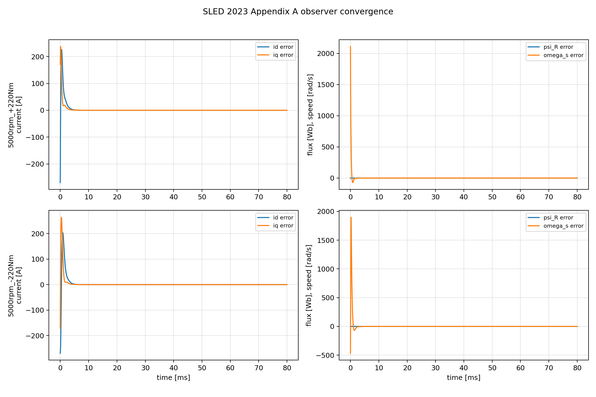
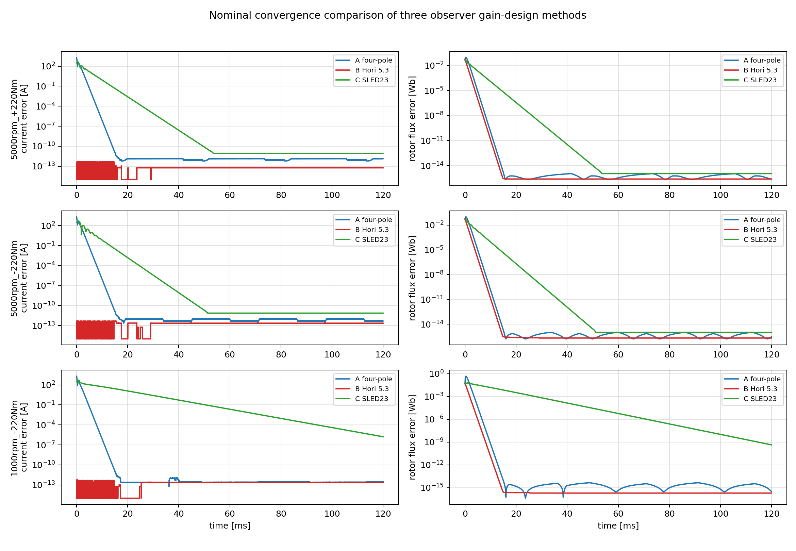
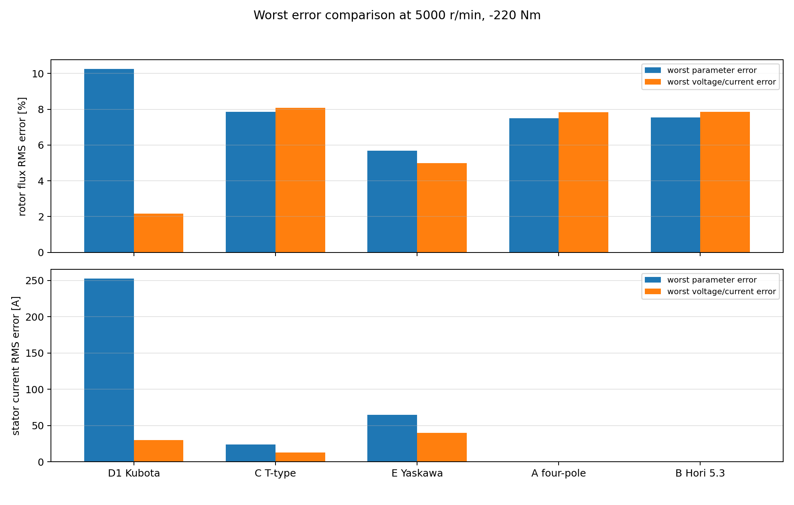

# 回転dq座標フルオーダ磁束オブザーバ設計・評価

本資料は、指定された誘導機定数を用いて、回転dq座標上のフルオーダ磁束オブザーバを設計し、一次磁束・二次磁束、および一次電流・二次電流の推定値が真値へ収束することを確認した結果をまとめたものである。

今回の方針は、固定座標ではなく、回転dq座標上の実数4状態モデルをそのまま扱う正攻法の極配置である。ここで「実数4状態」とは、複素数表現を使わずにd/q成分を実数ベクトルとして並べるという意味であり、固定αβ座標という意味ではない。d軸/q軸の回転対称性を使った2極相当の省略設計は使わず、オブザーバゲインは一般の実数行列

```math
H \in \mathbb{R}^{4\times 2}
```

として設計する。したがって、4状態に対応する4個のオブザーバ極をすべて明示的に配置する。

実装ではゲイン設計方式を切り替え可能にした。方式Aは「4個の実極を直接指定する方式」、方式Bは文献5.3の極配置思想に合わせて極の実部を $\alpha$、虚部を $\beta$ として指定する方式、方式CはSLED 2023 Appendix Aに基づく閉形式方式である。方式A/Bでは、オブザーバ状態は回転dq座標上の一次磁束・二次磁束の4状態のままであり、出力誤差から一般の実数 $H$ を計算する。方式Cでは、推定ロータ磁束座標という別の回転dq座標上で閉形式の更新式を用いる。

使用した誘導機定数は以下である。

| 記号 | 値 | 説明 |
|---|---:|---|
| $R_s$ | $0.00762\ \Omega$ | 一次抵抗 |
| $R_r$ | $0.008041\ \Omega$ | 二次抵抗 |
| $L_{ls}$ | $0.0000419\ \mathrm{H}$ | 一次漏れインダクタンス |
| $L_{lr}$ | $0.0000419\ \mathrm{H}$ | 二次漏れインダクタンス |
| $M=L_m$ | $0.0001608\ \mathrm{H}$ | 相互インダクタンス |
| $p$ | $4$ | 極対数 |

合成インダクタンスは以下で定義する。

```math
L_s=L_{ls}+M,\qquad L_r=L_{lr}+M,\qquad D=L_sL_r-M^2
```

方式Aの詳細評価は [scripts/run_flux_observer_evaluation.py](scripts/run_flux_observer_evaluation.py) に、3方式の共通評価は [scripts/run_gain_design_comparison.py](scripts/run_gain_design_comparison.py) にまとめている。C言語実装は [c/flux_observer.c](c/flux_observer.c)、[c/flux_observer.h](c/flux_observer.h)、[c/sled23_flux_observer.c](c/sled23_flux_observer.c)、[c/sled23_flux_observer.h](c/sled23_flux_observer.h) に置いた。

初学者向けに、式変形とゲイン設計をより丁寧に追った補足資料を [flux_observer_beginner_guide.md](flux_observer_beginner_guide.md) に作成した。

## 1. 概要

目的は、一次電圧、一次電流、ロータ機械角速度、および滑り角周波数から、回転dq座標上の一次磁束と二次磁束を推定することである。

状態変数は回転dq座標上の一次磁束と二次磁束であり、実数4状態として以下のように定義する。

```math
x=
\begin{bmatrix}
\psi_{sd} & \psi_{sq} & \psi_{rd} & \psi_{rq}
\end{bmatrix}^{T}
```

補正に使う測定出力は一次電流である。

```math
y=
\begin{bmatrix}
i_{sd} & i_{sq}
\end{bmatrix}^{T}
```

二次電流は直接測定しない。一次磁束・二次磁束の推定値から、オブザーバの出力として計算する。

評価条件は以下とした。

| 条件 | 速度 | トルク | $i_{sd}$ | $i_{sq}$ | $\omega_{\mathrm{slip}}$ |
|---|---:|---:|---:|---:|---:|
| 力行高速 | $5000\ \mathrm{r/min}$ | $+220\ \mathrm{Nm}$ | $673.610\ \mathrm{A}$ | $+426.722\ \mathrm{A}$ | $+25.130\ \mathrm{rad/s}$ |
| 回生高速 | $5000\ \mathrm{r/min}$ | $-220\ \mathrm{Nm}$ | $673.610\ \mathrm{A}$ | $-426.722\ \mathrm{A}$ | $-25.130\ \mathrm{rad/s}$ |
| 回生低速 | $1000\ \mathrm{r/min}$ | $-220\ \mathrm{Nm}$ | $673.610\ \mathrm{A}$ | $-426.722\ \mathrm{A}$ | $-25.130\ \mathrm{rad/s}$ |

回転dq座標の角速度は指定どおり以下とした。

```math
\omega_k=p\omega_m+\omega_{\mathrm{slip}}
```

## 2. 磁束オブザーバの構成

### 2.1 電流と磁束の関係

一次磁束、二次磁束、一次電流、二次電流をそれぞれ $\psi_s,\psi_r,i_s,i_r$ とする。d軸・q軸それぞれで、磁束と電流は以下の関係を満たす。

```math
\begin{bmatrix}
\psi_s\\
\psi_r
\end{bmatrix}
=
\begin{bmatrix}
L_s I_2 & M I_2\\
M I_2 & L_r I_2
\end{bmatrix}
\begin{bmatrix}
i_s\\
i_r
\end{bmatrix}
```

したがって、磁束から電流を計算する式は以下である。

```math
i_s=\frac{L_r\psi_s-M\psi_r}{D}
```

```math
i_r=\frac{-M\psi_s+L_s\psi_r}{D}
```

この式により、オブザーバは推定一次電流と推定二次電流を出力する。

### 2.2 回転dq座標の状態方程式

方式A/Bはこの節の回転dq座標モデルをそのまま使う。座標角速度は $\omega_k$ であり、固定αβ座標モデルではない。

90度回転行列を以下で定義する。

```math
J=
\begin{bmatrix}
0 & -1\\
1 & 0
\end{bmatrix}
```

一次電圧を $v_s=[v_{sd}\ v_{sq}]^T$、二次電圧を短絡として $v_r=0$ とする。回転dq座標の磁束方程式は以下である。

```math
\dot{\psi}_s=v_s-R_s i_s-\omega_k J\psi_s
```

```math
\dot{\psi}_r=-R_r i_r-(\omega_k-\omega_r)J\psi_r
```

ここで、ロータ電気角速度は以下である。

```math
\omega_r=p\omega_m
```

電流式を代入すると、回転dq座標上の実数4状態の状態方程式は以下になる。

```math
\dot{x}=Ax+Bv_s
```

```math
A=
\begin{bmatrix}
-\frac{R_sL_r}{D}I_2-\omega_kJ & \frac{R_sM}{D}I_2\\
\frac{R_rM}{D}I_2 & -\frac{R_rL_s}{D}I_2-(\omega_k-\omega_r)J
\end{bmatrix}
```

```math
B=
\begin{bmatrix}
I_2\\
0_{2\times2}
\end{bmatrix}
```

一次電流出力は以下である。

```math
y=Cx
```

```math
C=
\begin{bmatrix}
\frac{L_r}{D}I_2 & -\frac{M}{D}I_2
\end{bmatrix}
```

二次電流出力は以下で計算する。

```math
i_r=C_r x
```

```math
C_r=
\begin{bmatrix}
-\frac{M}{D}I_2 & \frac{L_s}{D}I_2
\end{bmatrix}
```

### 2.3 オブザーバ式

本資料で用いるLuenberger型オブザーバは以下である。

```math
\dot{\hat{x}}=A_o\hat{x}+B_o v_{s,m}+H\left(y_m-C_o\hat{x}\right)
```

ここで、$A_o,B_o,C_o$ はオブザーバ内部で使用するモータ定数から作った行列であり、$v_{s,m},y_m$ は測定電圧と測定一次電流である。定数誤差評価では、真値モデルには基準定数を使い、オブザーバ内部行列には誤差付き定数を使った。

ゲイン $H$ は一般の実数 $4\times2$ 行列とする。

```math
H=
\begin{bmatrix}
H_{00} & H_{01}\\
H_{10} & H_{11}\\
H_{20} & H_{21}\\
H_{30} & H_{31}
\end{bmatrix}
```

この設計では、d軸/q軸が独立、または完全対称であるという仮定でゲインを減らさない。速度干渉項を含んだ回転dq座標の実数4状態モデルに対し、4個の極をすべて配置する。

## 3. オブザーバゲイン設計法

### 3.1 極配置法の基本

連続時間の線形状態方程式を以下とする。

```math
\dot{x}=Ax+Bu
```

```math
y=Cx
```

オブザーバを以下で構成する。

```math
\dot{\hat{x}}=A\hat{x}+Bu+H(y-C\hat{x})
```

推定誤差を以下で定義する。

```math
\tilde{x}=x-\hat{x}
```

この時間微分を取ると、

```math
\dot{\tilde{x}}=\dot{x}-\dot{\hat{x}}
```

である。真値モデルとオブザーバ式を代入すると、同じ入力 $Bu$ は差し引きで消え、さらに $y=Cx$ より以下を得る。

```math
\dot{\tilde{x}}=(A-HC)\tilde{x}
```

つまり、オブザーバの収束速度と振動性は $A-HC$ の固有値で決まる。この固有値を設計者が指定した位置へ動かすことを、オブザーバの極配置と呼ぶ。

状態数が4なので、今回のオブザーバ極も4個である。4状態すべての誤差を設計対象にするため、目標極は

```math
p_1,p_2,p_3,p_4
```

の4個を指定する。

### 3.2 方式A: 4実極を直接指定する従来方式

今回の基準設計では、観測帯域を

```math
\omega_o=2200\ \mathrm{rad/s}
```

とし、目標極を以下に置いた。

```math
p_1=-\omega_o
```

```math
p_2=-1.25\omega_o
```

```math
p_3=-1.55\omega_o
```

```math
p_4=-2.0\omega_o
```

数値では以下である。

| 極 | 値 |
|---|---:|
| $p_1$ | $-2200\ \mathrm{rad/s}$ |
| $p_2$ | $-2750\ \mathrm{rad/s}$ |
| $p_3$ | $-3410\ \mathrm{rad/s}$ |
| $p_4$ | $-4400\ \mathrm{rad/s}$ |

$\omega_o=2200\ \mathrm{rad/s}$ は、電流制御帯域 $\omega_{cc}=1000\ \mathrm{rad/s}$ より速く、かつ測定ノイズや離散化誤差を過度に増幅しない範囲として選んだ。1.25、1.55、2.0の倍率は、重根を避け、4個の極を適度に分離して数値条件を悪化させにくくするための設計例である。

制御周期を $T_s=100\ \mu\mathrm{s}$ とすると、最速極 $4400\ \mathrm{rad/s}$ はサンプリング角周波数 $2\pi/T_s=62832\ \mathrm{rad/s}$ の約7.0%であり、離散化に対して余裕がある。

C APIでは、標準設定として `FluxObserver_SetPolePlacement(&observer, 2200.0f, 2.0f)` を用いる。個別に4個の極を指定したい場合は `FluxObserver_SetObserverPoles()` を使う。

### 3.3 方式B: 文献5.3の alpha/beta 指定を使ったSylvester派生方式

文献5.3の方法の要点は、誘導機のd/q軸対称性を利用し、オブザーバ極の実部と虚部を設計パラメータとして直接指定できる形にすることである。ここで注意すべき点は、文献5.3そのものが本成果物で使うSylvester方程式

```math
T A_o-F T=G C_o
```

を解いている、という意味ではないことである。Sylvester方程式は、文献5.3のalpha/beta極指定を、今回の回転dq座標4状態フルオーダ実装へ写すために本成果物側で採用した一般的な極配置の計算法である。

通常の実数状態空間で4個の極を個別に並べるだけでは、d軸とq軸の回転結合をどう扱った設計なのかが見えにくい。これに対し、alpha/beta指定では「減衰」と「回転」を分けて指定する。

ここでは極の実部の大きさを alpha、虚部を beta と呼び、目標極を以下の共役複素極に置く。

```math
p=-\alpha \pm j\beta
```

この極の意味は以下である。

| パラメータ | 意味 |
|---|---|
| $\alpha$ | 推定誤差包絡線の減衰速度。大きいほど収束は速いが、電流ノイズや離散化誤差を増幅しやすい。 |
| $\beta$ | d/q軸間で誤差が回り込む角周波数。実部だけでなく虚部も指定することで、回転座標系らしい共役極を作る。 |

2状態の誤差ベクトル $e_{dq}=[e_d,e_q]^T$ に対して、

```math
\dot{e}_{dq}=
\begin{bmatrix}
-\alpha & -\beta\\
\beta & -\alpha
\end{bmatrix}e_{dq}
```

とすると、解は以下の形になる。

```math
e_{dq}(t)=e^{-\alpha t}
\begin{bmatrix}
\cos\beta t & -\sin\beta t\\
\sin\beta t & \cos\beta t
\end{bmatrix}
e_{dq}(0)
```

したがって、$\alpha$ は誤差の大きさを指数的に減衰させ、$\beta$ は誤差ベクトルをd/q平面内で回転させる。この「減衰する回転」という形が、回転座標上の誘導機オブザーバに対して自然な極配置である。

本成果物では、最小次元化や複素ゲイン表現へは移行しない。状態変数を回転dq座標上の一次磁束・二次磁束の4状態として維持し、文献5.3の alpha/beta 指定を、実数4状態の目標誤差行列として以下のように与える。

```math
F_{\alpha\beta}=
\begin{bmatrix}
-\alpha & -\beta & 0 & 0\\
\beta & -\alpha & 0 & 0\\
0 & 0 & -\alpha & -\beta\\
0 & 0 & \beta & -\alpha
\end{bmatrix}
```

この行列の固有値は $-\alpha+j\beta$ と $-\alpha-j\beta$ であり、同じ共役極を2組持つ。したがって、d/qの回転性を持つ4状態誤差系に対して、文献5.3の alpha/beta 極配置を同一次元フルオーダの枠組みで使える。

ここで重要なのは、方式Bが「論文5.3のオブザーバをそのまま実装したもの」ではない点である。本成果物では、既存のフルオーダ4状態オブザーバとC APIを維持するため、論文5.3の極指定思想だけを取り込み、目標誤差行列 $F_{\alpha\beta}$ として実装している。つまり方式Bは、以下の対応で理解する。

| 文献5.3の考え方 | 本成果物での実装 |
|---|---|
| d/q対称性を考慮し、極の実部と虚部を指定する | $F_{\alpha\beta}$ の2個の回転ブロックで表す |
| オブザーバ利得を極指定値から計算する | 同じ極を持つように、一般の極配置計算としてSylvester方程式で $H$ を計算する |
| 論文側の整理された座標・表現を使う | 回転dq座標の実数4状態のまま扱い、組込みC APIとの互換性を保つ |

方式Bの設計手順は以下である。

1. 設計者が $\alpha,\beta$ を決める。
2. $\alpha,\beta$ から $F_{\alpha\beta}$ を作る。
3. 現在の動作点の $A_o,C_o$ を作る。
4. Sylvester方程式 $T A_o-F_{\alpha\beta}T=G_B C_o$ を解く。
5. $H=T^{-1}G_B$ とする。
6. 得られた $H$ により、誤差方程式 $\dot{\tilde{x}}=(A_o-HC_o)\tilde{x}$ の固有値を $-\alpha\pm j\beta$ の2組へ配置する。

この方式の利点は、方式Aのように4個の実極を個別に並べるより、設計パラメータの意味が読みやすい点である。一方、計算自体は方式Aと同じSylvester方程式であり、オンライン計算負荷は軽くならない。したがって方式Bは、文献5.3そのものの再実装ではなく、文献5.3のalpha/beta極指定を現在の回転dq座標4状態実装へ接続して比較するための派生方式である。

この方式を使う場合、C APIでは以下を呼ぶ。

```c
FluxObserver_SetHori53PolePlacement(&observer, alpha_rad_s, beta_rad_s);
```

Pythonでは以下のように指定する。

```python
H = observer_H_gain_by_pole_placement(
    params,
    omega_r,
    omega_k,
    gain_design=GAIN_DESIGN_HORI_5_3,
    hori_alpha=alpha_rad_s,
    hori_beta=beta_rad_s,
)
```

注意点として、今回のSylvester方程式の実装では、固定した分配行列 $G$ と同一の実極重複を組み合わせると特異になりやすい。そのため、このalpha/beta派生方式では beta を正の有限値として指定する。非振動の実極を個別に指定したい場合は、方式Aの `FluxObserver_SetObserverPoles()` を使う。

### 3.4 Sylvester方程式による極配置

今回の実装は、回転dq座標の実数4状態行列 $A_o,C_o$ をそのまま使う。目標誤差ダイナミクスを以下で定義する。

```math
F=F_{\mathrm{target}}
```

方式Aでは $F_{\mathrm{target}}=\mathrm{diag}(p_1,p_2,p_3,p_4)$ であり、方式Bでは $F_{\mathrm{target}}=F_{\alpha\beta}$ である。

出力誤差を4状態へ配分する行列を $G$ とする。方式Aでは前版と同じ以下を使う。

```math
G_A=
\begin{bmatrix}
1 & 0\\
0 & 1\\
1 & 0\\
0 & 1
\end{bmatrix}
```

方式Bでは以下を使う。

```math
G_B=
\begin{bmatrix}
1 & 0\\
0 & 1\\
0 & 1\\
1 & 0
\end{bmatrix}
```

この $G$ は設計上の計算行列であり、物理量を直接意味するものではない。方式Aの $G_A$ は前版との互換性を保つために残した。方式Bでは $F_{\alpha\beta}$ が同じ共役極を2組持つため、方式Aと同じ $G_A$ を使うとSylvester方程式の解 $T$ が特異になる。そこで、ロータ磁束側の配分をd/qで入れ替えた $G_B$ を用い、重複共役極に対して $T$ が正則になる組にしている。

次のSylvester方程式を解く。

```math
T A_o - F T = G C_o
```

$T$ が正則であれば、オブザーバゲインを以下で計算する。

```math
H=T^{-1}G
```

このとき、

```math
T(A_o-HC_o)=F T
```

が成り立つ。したがって、

```math
A_o-HC_o=T^{-1}FT
```

となり、$A_o-HC_o$ は $F$ と相似である。相似な行列は同じ固有値を持つため、オブザーバ誤差行列の4個の極は指定した $p_1,p_2,p_3,p_4$ に一致する。

実装では各制御周期で以下の順に計算する。

1. APIからモータ定数と制御周期を取得する。
2. 入力された $\omega_m$ と $\omega_{\mathrm{slip}}$ から $\omega_r=p\omega_m$ と $\omega_k=\omega_r+\omega_{\mathrm{slip}}$ を計算する。
3. 現在の速度条件で $A_o,B_o,C_o$ を作る。
4. 目標極から $F$ を作る。
5. $T A_o - F T = G C_o$ を実数16元連立一次方程式として解く。
6. $H=T^{-1}G$ を解く。
7. 得られた $H$ でオブザーバを1ステップ積分する。

Python実装では `observer_H_gain_by_pole_placement()` がこの計算を行う。C実装では `fo_observer_H()` が同じ計算を行う。複素数表現による省略やd/q対称性によるゲイン削減は使っていない。


### 3.5 方式C: SLED 2023 Appendix Aの閉形式オブザーバ

追加で、Tiitinen, Hinkkanen, HarneforsのSLED 2023論文 Appendix Aに基づく実装も追加した。この方式は、先ほどのSylvester法とは異なる。

Sylvester法では、状態を

```math
x=
\begin{bmatrix}
\psi_{sd} & \psi_{sq} & \psi_{rd} & \psi_{rq}
\end{bmatrix}^{T}
```

とし、目標行列 $F$ を指定して

```math
T A_o - F T = G C_o
```

を解くことで $H=T^{-1}G$ を求める。一方、SLED 2023 Appendix Aの方式では、推定ロータ磁束座標上で、状態を

```math
\hat{x}=
\begin{bmatrix}
\hat{i}_{sd} & \hat{i}_{sq} & \hat{\psi}_{R}
\end{bmatrix}^{T}
```

として扱う。ここで $\hat{\psi}_{R}$ は推定ロータ磁束の大きさであり、推定ロータ磁束座標では

```math
\hat{\psi}_{R}=
\begin{bmatrix}
\hat{\psi}_{R} & 0
\end{bmatrix}^{T}
```

である。

標準のT形等価回路定数から、SLED論文の逆Γ形定数は以下で計算する。

```math
L_{\sigma}=L_s-\frac{M^2}{L_r}
```

```math
L_M=\frac{M^2}{L_r}
```

```math
R_R=R_r\left(\frac{M}{L_r}\right)^2
```

```math
R_{\sigma}=R_s+R_R
```

```math
\alpha=\frac{R_R}{L_M}
```

この座標系では、二次磁束ベクトルそのものをd/qの2成分で持つのではなく、推定ロータ磁束方向をd軸に選ぶ。したがって、推定ロータ磁束のq軸成分は常に0である。

```math
\hat{\psi}_{Rq}=0
```

この制約を満たすように、座標の回転角速度 $\omega_s$ をオブザーバ内部で計算する。つまりAppendix A方式では、$\omega_s$ は単なる入力ではなく、推定ロータ磁束軸を保つためのオブザーバ構成要素である。実装上は、$\omega_s$ を積分すれば推定ロータ磁束角が得られ、その角度で電圧・電流を推定ロータ磁束座標へ変換する。

この点が方式A/Bとの大きな違いである。方式A/Bでは、座標角速度を決める $\omega_{\mathrm{slip}}$ を外部から与える。一方、方式Cでは、すべり周波数は外部から与える値ではなく、$\hat{\psi}_{Rq}=0$ を保つための代数式としてオブザーバ内で決まる。したがって、方式Cのオブザーバ構成とすべり周波数計算式は切り離せない。

q軸ロータ磁束の拘束式を明示すると、方式Cでは次を満たすように $\omega_s$ を選ぶ。

```math
\frac{d\hat{\psi}_{Rq}}{dt}
=
R_R i_{sq}
+k_2\alpha_iL_{\sigma}\tilde{i}_{sd}
-\gamma L_{\sigma}\tilde{i}_{sq}
-(\omega_s-\hat{\omega}_m)(\hat{\psi}_R-L_{\sigma}\tilde{i}_{sd})
=0
```

この式を $\omega_s$ について解いたものが、後述の $\omega_s$ 計算式である。分母 $\hat{\psi}_R-L_{\sigma}\tilde{i}_{sd}$ が0でない範囲では、この $\omega_s$ 式は $\hat{\psi}_{Rq}=0$ を保つための十分条件であり、同時にこのオブザーバ方程式の中では必要条件でもある。実装では低磁束時に分母下限保護を入れるため、保護が動作している領域では厳密な等価性より数値安定性を優先する。

このため、Appendix A方式の状態数は一見3個である。

```math
\hat{x}=
\begin{bmatrix}
\hat{i}_{sd} & \hat{i}_{sq} & \hat{\psi}_{R}
\end{bmatrix}^{T}
```

ただし、これは物理的な磁束状態を削ったという意味ではない。ロータ磁束ベクトルの角度は、状態ベクトルではなく座標角として外側で積分される。したがって、推定電流2成分、推定ロータ磁束の大きさ、推定座標角を合わせて、物理的にはフルオーダの情報を保持している。

電流推定誤差を以下で定義する。

```math
\tilde{i}_{sd}=i_{sd}-\hat{i}_{sd},\qquad
\tilde{i}_{sq}=i_{sq}-\hat{i}_{sq}
```

Appendix A方式の更新式は以下である。

```math
L_{\sigma}\frac{d\hat{i}_{sd}}{dt}
=
\alpha\hat{\psi}_R
-R_{\sigma}\hat{i}_{sd}
+\omega_s L_{\sigma}\hat{i}_{sq}
+u_{sd}
+L_{\sigma}(\gamma\tilde{i}_{sd}-\hat{\omega}_m\tilde{i}_{sq})
```

```math
L_{\sigma}\frac{d\hat{i}_{sq}}{dt}
=
-\hat{\omega}_m\hat{\psi}_R
-R_{\sigma}\hat{i}_{sq}
-\omega_s L_{\sigma}\hat{i}_{sd}
+u_{sq}
+L_{\sigma}(\gamma\tilde{i}_{sq}+\hat{\omega}_m\tilde{i}_{sd})
```

```math
\frac{d\hat{\psi}_R}{dt}
=
-\alpha\hat{\psi}_R
+R_R\hat{i}_{sd}
+(k_1\alpha_i-\gamma)L_{\sigma}\tilde{i}_{sd}
-(\omega_s-\hat{\omega}_m)L_{\sigma}\tilde{i}_{sq}
```

```math
\omega_s
=
\hat{\omega}_m+
\frac{
R_R i_{sq}
+k_2\alpha_iL_{\sigma}\tilde{i}_{sd}
-\gamma L_{\sigma}\tilde{i}_{sq}
}{
\hat{\psi}_R-L_{\sigma}\tilde{i}_{sd}
}
```

ここで、

```math
\gamma=\alpha_i-\alpha
```

```math
k_1=\frac{b\alpha}{\alpha^2+\hat{\omega}_m^2},\qquad
k_2=\frac{b\hat{\omega}_m}{\alpha^2+\hat{\omega}_m^2}
```

である。式の意味を分解すると以下になる。

| 項 | 役割 |
|---|---|
| $\alpha\hat{\psi}_R$, $R_R\hat{i}_{sd}$ | 逆Γ形誘導機モデルそのものの磁化・減衰項 |
| $R_{\sigma}\hat{i}_s$ | 一次抵抗と等価二次抵抗を含む電流減衰項 |
| $\omega_s L_{\sigma}J\hat{i}_s$ | 推定ロータ磁束座標が回転することによるdq軸干渉項 |
| $\gamma\tilde{i}_{sd},\gamma\tilde{i}_{sq}$ | 電流推定誤差を直接減衰させる注入項 |
| $\hat{\omega}_m\tilde{i}_{sd},\hat{\omega}_m\tilde{i}_{sq}$ | 回転座標で電流誤差を注入するときに必要な交差補償 |
| $k_1,k_2$ | 磁束推定誤差の減衰率 $b$ を、d/q軸方向の電流誤差注入へ変換する係数 |
| $\omega_s$ の式 | $\hat{\psi}_{Rq}=0$ を保つために、q軸ロータ磁束微分を0にする代数拘束 |
| $\omega_s$ の分母 $\hat{\psi}_R-L_{\sigma}\tilde{i}_{sd}$ | q軸ロータ磁束拘束式を $\omega_s$ について解いたときの係数。低磁束時に小さくなるため実装では下限保護が必要 |

SLED方式の設計パラメータは、電流推定誤差の減衰率 $\alpha_i$ と、磁束推定誤差の減衰を決める $b$ である。実装では、論文のスケジューリングに合わせて標準では

```math
b=2\zeta_{\infty}|\hat{\omega}_m|+\alpha
```

を使う。固定値で評価したい場合はC APIで $b$ を直接指定できる。

設計パラメータの意味は以下である。

| パラメータ | 意味 | 大きくしたときの傾向 |
|---|---|---|
| $\alpha_i$ | 推定電流誤差の減衰率 | 電流推定は速くなるが、測定ノイズと離散化誤差に敏感になる |
| $b$ | 磁束推定誤差の減衰率 | 磁束推定は速くなるが、高速域では過度な補正によりノイズ感度が上がる |
| $\zeta_{\infty}$ | 高速域での磁束推定モードの減衰比を決める係数 | 高速時の減衰が強くなる |

論文の小信号解析では、提案ゲインにより磁束推定ダイナミクスと速度推定ダイナミクスが分離される。速度適応まで含む論文の形では、正の $b,\alpha_i,\alpha_o$ に対して局所安定な特性多項式が得られる。本成果物では速度センサありの評価を対象とし、速度適応ゲイン $\alpha_o$ は実装していない。そのため、実装上の安定性確認は「速度を入力として与えるオブザーバ単体」の収束評価として行っている。

Appendix A方式の実装手順は以下である。

1. APIから $R_s,R_r,L_{ls},L_{lr},M,T_s$ を取得する。
2. T形定数から逆Γ形定数 $L_{\sigma},L_M,R_R,R_{\sigma},\alpha$ を計算する。
3. 測定した三相電圧・三相電流を推定ロータ磁束座標へ変換し、$u_{sd},u_{sq},i_{sd},i_{sq}$ を作る。
4. 電流推定誤差 $\tilde{i}_{sd},\tilde{i}_{sq}$ を計算する。
5. $\alpha_i,b$ から $\gamma,k_1,k_2$ を計算する。
6. $\hat{\psi}_{Rq}=0$ の拘束、すなわち $d\hat{\psi}_{Rq}/dt=0$ から、代数式で $\omega_s$ を計算する。
7. 上記の微分方程式を制御周期 $T_s$ で積分し、$\hat{i}_{sd},\hat{i}_{sq},\hat{\psi}_R$ を更新する。
8. $\omega_s$ を積分して次周期の推定ロータ磁束角を更新する。

方式A/Bとの本質的な違いは、方式Cでは「極配置のために線形代数問題を毎周期解く」のではなく、論文で整理された閉形式の係数 $k_1,k_2,\gamma$ と、$\hat{\psi}_{Rq}=0$ 拘束から得られる $\omega_s$ を直接計算する点である。したがって、組込み機器では方式Cの計算負荷が最も小さい。一方で、入力電圧・入力電流を推定ロータ磁束座標へ正しく変換する必要があり、低磁束時の分母保護も必須である。

本評価およびC APIの標準値は、3動作点で収束を確認した以下とする。

```math
\alpha_i=1000\ \mathrm{rad/s},\qquad \zeta_{\infty}=0.4
```

この方式の特徴は、ゲイン計算が閉形式であり、制御周期ごとに16元連立一次方程式を解かないことである。したがって、組込み機器に搭載する観点では、Sylvester法を毎周期実行する方式よりもこちらのほうが実装負荷は小さい。SLED 2023 Appendix Aの式は、Cでは [c/sled23_flux_observer.c](c/sled23_flux_observer.c) と [c/sled23_flux_observer.h](c/sled23_flux_observer.h) に実装した。Python確認用には [scripts/run_sled23_appendix_observer_demo.py](scripts/run_sled23_appendix_observer_demo.py) を追加した。

デモでは、5000 r/min, +220 Nm、5000 r/min, -220 Nm、1000 r/min, -220 Nmの3条件で、初期推定誤差を与えても推定電流と推定ロータ磁束が真値へ収束することを確認した。



### 3.6 3方式の比較と採用方針

本資料では、以下の3方式を実装した。

| 方式 | 概要 | 主な用途 |
|---|---|---|
| 方式A | 回転dq座標の実数4状態モデルに対し、4個の実極を直接指定し、Sylvester方程式で $H$ を求める | オフライン設計、検証基準、ゲインテーブル生成 |
| 方式B | 文献5.3の alpha/beta 極指定だけを取り出し、回転dq座標4状態の目標行列 $F_{\alpha\beta}$ として扱ってSylvester方程式で $H$ を求める派生方式 | 文献5.3の極指定思想の比較、概念検証 |
| 方式C | SLED 2023 Appendix Aに基づき、推定ロータ磁束座標で閉形式の更新式を使う | 組込み実装、オンライン実行 |

結論から言うと、組込み機器に搭載する前提では、方式Cが最も有力である。

理由は以下である。

| 評価観点 | 方式A: 4実極Sylvester | 方式B: alpha/beta Sylvester | 方式C: SLED 2023閉形式 |
|---|---|---|---|
| ゲイン設計の自由度 | 4極を直接指定できる | alpha/betaで共役極を指定できる | $b,\alpha_i$ による構造化設計 |
| 理論の見通し | $A-HC$ の極配置として明快 | 共役極指定として見通しは良いが、今回の実装では $G$ の選び方に注意が必要 | 論文上、推定誤差の結合が整理されており、設計パラメータの意味が比較的明確 |
| 毎周期計算負荷 | 重い。16元連立一次方程式と $T^{-1}G$ が必要 | 重い。方式Aと同じくSylvester方程式を解く | 軽い。閉形式であり、主に四則演算で済む |
| 組込み実装性 | 毎周期オンライン計算には不向き。オフライン計算またはテーブル化なら可 | 毎周期オンライン計算には不向き。加えて重複極で特異性に注意 | 最も良い。リアルタイム周期内に載せやすい |
| 既存APIとの整合 | 現在の `FluxObserver` と整合する | 現在の `FluxObserver` と整合する | 状態と座標系が異なるため、別APIとして扱う必要がある |
| 注意点 | 極倍率の選び方が設計者依存になりやすい | 今回の実装は文献5.3の思想を同一次元の回転dq実数4状態へ写した派生方式であり、文献5.3そのものがSylvester方程式を解くという意味ではない | 推定ロータ磁束座標への変換、低速センサレス限界、分母 $\hat{\psi}_R-L_{\sigma}\tilde{i}_{sd}$ の扱いに注意 |

方式Aの最大の利点は、回転dq座標の実数4状態モデルに対して「指定した4極が本当に入る」ことを直接確認できる点である。したがって、理論確認、ベンチマーク、あるいはゲインテーブルをオフライン生成する用途には適している。一方で、組込み機器で毎制御周期に実行するには計算負荷が大きい。制御周期が $100\ \mu\mathrm{s}$ 程度の場合、16元連立一次方程式を毎回解く設計は避けたい。

方式Bは、alpha/betaで極を指定できるため、方式Aより設計パラメータの意味は読みやすい。ただし、今回の実装では方式Aと同じSylvester方程式を使っており、計算負荷の問題は解決していない。また、同じ共役極を2組持たせるため、分配行列 $G$ の選定によって $T$ が特異になる。このため、方式Bは最終実装候補というより、文献5.3の極指定思想を現在の回転dq座標4状態オブザーバに接続して比較するための独自実装と位置付ける。

方式Cは、状態変数と座標系を変えるため、方式A/Bと完全に同じAPIでは扱えない。しかし、SLED 2023 Appendix Aの式は推定ロータ磁束座標上で整理されており、ゲインが閉形式で計算できる。これは組込み実装上の大きな利点である。特に、毎周期の処理がオブザーバ更新式と簡単な係数計算に限られ、Sylvester方程式を解く必要がない。

したがって、本成果物の採用方針は以下とする。

1. 量産または実機組込みを前提にする場合は、方式Cを第一候補とする。
2. 方式Aは、方式Cの妥当性確認、オフライン設計、またはゲインテーブル生成用の基準モデルとして残す。
3. 方式Bは、文献5.3のalpha/beta極指定との対応確認用として残すが、最終組込み実装の第一候補にはしない。

ただし、方式Cを採用する場合も、推定ロータ磁束座標への入力電圧・入力電流変換、低速・低磁束時の分母保護、定数誤差時の閉ループ安定性は別途検証が必要である。今回のデモでは5000 r/min力行、5000 r/min回生、1000 r/min回生の3条件で収束を確認したが、低速センサレス運転や弱め界磁領域まで含めた評価は、制御系全体に組み込んだ状態で実施する必要がある。

## 4. オブザーバの安定性の証明

まず、定数誤差、電圧誤差、電流誤差がない場合を考える。このとき真値モデルとオブザーバ内部モデルは一致する。

```math
\dot{x}=Ax+Bv_s
```

```math
\dot{\hat{x}}=A\hat{x}+Bv_s+H(y-C\hat{x})
```

推定誤差 $\tilde{x}=x-\hat{x}$ の時間微分は以下である。

```math
\dot{\tilde{x}}=\dot{x}-\dot{\hat{x}}
```

上の2式を代入すると、同じ入力 $Bv_s$ は消える。

```math
\dot{\tilde{x}}=A(x-\hat{x})-H(y-C\hat{x})
```

無誤差時は $y=Cx$ であるため、

```math
y-C\hat{x}=C(x-\hat{x})=C\tilde{x}
```

である。したがって、

```math
\dot{\tilde{x}}=(A-HC)\tilde{x}
```

となる。

3.3節の設計により、$A-HC$ は $F$ と相似であり、固有値は以下である。

```math
\lambda(A-HC)=\{p_1,p_2,p_3,p_4\}
```

今回の設計では4個すべての極が負の実数である。

```math
\mathrm{Re}(p_i)<0\qquad (i=1,2,3,4)
```

したがって、固定速度の凍結動作点では推定誤差は指数的に0へ収束する。すなわち、適当な正定数 $K,\alpha$ が存在し、以下を満たす。

```math
\|\tilde{x}(t)\|\le K e^{-\alpha t}\|\tilde{x}(0)\|
```

定数誤差、電圧誤差、電流誤差がある場合は、誤差方程式に外乱項 $d(t)$ が加わる。

```math
\dot{\tilde{x}}=(A_o-HC_o)\tilde{x}+d(t)
```

$A_o-HC_o$ がHurwitz、すなわち全固有値の実部が負であり、$d(t)$ が有界であれば、推定誤差も有界に保たれる。この場合、誤差は完全には0にならず、定数誤差や測定誤差に応じた定常誤差へ収束する。

なお、本評価は一定速度・一定滑りの凍結動作点で実施した。速度急変を含む一般の線形時変系としての大域安定性を主張するには、ゲインスケジューリング速度や共通Lyapunov関数の確認が別途必要である。

## 5. 誤差無し/有の評価結果

### 5.1 評価方法

評価は2種類のスクリプトで行った。方式Aの詳細波形と誤差掃引は従来の評価スクリプトで確認し、方式A/B/Cの横並び比較は3方式共通評価スクリプトで行った。

```powershell
python .\flux_observer_design\scripts\run_flux_observer_evaluation.py
python .\flux_observer_design\scripts\run_gain_design_comparison.py
```

生成物は以下である。

| ファイル | 内容 |
|---|---|
| [data/evaluation_summary.csv](data/evaluation_summary.csv) | 全評価ケースの数値結果 |
| [data/gain_design_comparison_summary.csv](data/gain_design_comparison_summary.csv) | 方式A/B/Cを同一条件で評価した全数値結果 |
| [data/gain_design_nominal_comparison.csv](data/gain_design_nominal_comparison.csv) | 無誤差時の3方式比較 |
| [data/gain_design_worst_error_comparison.csv](data/gain_design_worst_error_comparison.csv) | 5000 r/min, -220 Nm条件の最悪誤差比較 |
| [figures/nominal_waveform_5000rpm_motoring.png](figures/nominal_waveform_5000rpm_motoring.png) | 5000 r/min力行の無誤差波形 |
| [figures/nominal_waveform_5000rpm_regen.png](figures/nominal_waveform_5000rpm_regen.png) | 5000 r/min回生の無誤差波形 |
| [figures/nominal_waveform_1000rpm_regen.png](figures/nominal_waveform_1000rpm_regen.png) | 1000 r/min回生の無誤差波形 |
| [figures/nominal_convergence.png](figures/nominal_convergence.png) | 3動作点の収束誤差 |
| [figures/gain_design_nominal_convergence.png](figures/gain_design_nominal_convergence.png) | 方式A/B/Cの無誤差収束比較 |
| [figures/gain_design_worst_error_summary.png](figures/gain_design_worst_error_summary.png) | 方式A/B/Cの最悪誤差比較 |
| [figures/parameter_error_sweep.png](figures/parameter_error_sweep.png) | 定数誤差感度 |
| [figures/sensor_error_summary.png](figures/sensor_error_summary.png) | 電圧・電流誤差感度 |

シミュレーション条件は以下である。本評価はオブザーバ単体の評価であり、電流制御器、速度制御器、トルク制御器、滑り演算器を含む閉ループ制御系の評価ではない。

| 項目 | 値 |
|---|---:|
| シミュレーション時間 | $0.12\ \mathrm{s}$ |
| 積分刻み | $10\ \mu\mathrm{s}$ |
| 初期推定誤差 | 一次・二次磁束に大きな初期誤差を付与 |
| 誤差評価窓 | 最終20%区間のRMS |

比較した3方式の設計値は以下である。

| 方式 | 設計値 |
|---|---|
| 方式A | $-2200,-2750,-3410,-4400\ \mathrm{rad/s}$ の4実極 |
| 方式B | $\alpha=2200\ \mathrm{rad/s}$, $\beta=500\ \mathrm{rad/s}$ の共役極2組 |
| 方式C | $\alpha_i=1000\ \mathrm{rad/s}$, $\zeta_{\infty}=0.4$ |

定数誤差は、$R_s,R_r,M,L_{ls},L_{lr}$ を1つずつ以下の刻みで変化させた。

```math
\pm 5\%,\qquad \pm 10\%,\qquad \pm 20\%
```

電圧誤差と電流誤差は以下とした。

| 誤差種別 | 条件 |
|---|---|
| 電圧ゲイン誤差 | $\pm 5\%$ |
| 電圧オフセット | $+1\ \mathrm{V}$ on d軸, $-1\ \mathrm{V}$ on q軸 |
| 電流ゲイン誤差 | $\pm 1\%$ |
| 電流オフセット | $+1\ \mathrm{A}$ on d軸, $-1\ \mathrm{A}$ on q軸 |
| 電流ノイズ | $1\ \mathrm{A_{rms}}$ on d/q軸 |

### 5.2 無誤差時の収束

無誤差では、3方式とも3動作点すべてで推定値が真値へ収束した。方式A/Bは $\omega_k=p\omega_m+\omega_{\mathrm{slip}}$ で回る回転dq座標の4状態磁束オブザーバ、方式CはSLED 2023 Appendix Aの推定ロータ磁束座標オブザーバであり、どちらも固定αβ座標ではない。ただし、方式A/Bと方式Cでは状態変数と回転座標の取り方が異なる。そのため絶対値を完全に横並び比較するより、同一条件で発散せず収束すること、収束時間と誤差感度の傾向を見ることが重要である。

| 方式 | 条件 | 二次磁束RMS誤差 | 一次電流RMS誤差 | 二次磁束1%収束 | 一次電流1A収束 |
|---|---|---:|---:|---:|---:|
| 方式A | 5000 r/min, +220 Nm | $6.52\times10^{-13}\%$ | $1.17\times10^{-12}\ \mathrm{A}$ | $2.75\ \mathrm{ms}$ | $3.64\ \mathrm{ms}$ |
| 方式B | 5000 r/min, +220 Nm | $4.12\times10^{-13}\%$ | $2.42\times10^{-12}\ \mathrm{A}$ | $3.00\ \mathrm{ms}$ | $4.05\ \mathrm{ms}$ |
| 方式C | 5000 r/min, +220 Nm | $1.32\times10^{-12}\%$ | $8.21\times10^{-12}\ \mathrm{A}$ | $6.55\ \mathrm{ms}$ | $9.69\ \mathrm{ms}$ |
| 方式A | 5000 r/min, -220 Nm | $5.34\times10^{-13}\%$ | $8.51\times10^{-13}\ \mathrm{A}$ | $2.82\ \mathrm{ms}$ | $3.71\ \mathrm{ms}$ |
| 方式B | 5000 r/min, -220 Nm | $5.82\times10^{-13}\%$ | $9.91\times10^{-13}\ \mathrm{A}$ | $3.05\ \mathrm{ms}$ | $4.10\ \mathrm{ms}$ |
| 方式C | 5000 r/min, -220 Nm | $1.20\times10^{-12}\%$ | $7.28\times10^{-12}\ \mathrm{A}$ | $6.26\ \mathrm{ms}$ | $9.43\ \mathrm{ms}$ |
| 方式A | 1000 r/min, -220 Nm | $1.74\times10^{-12}\%$ | $2.45\times10^{-13}\ \mathrm{A}$ | $3.50\ \mathrm{ms}$ | $3.65\ \mathrm{ms}$ |
| 方式B | 1000 r/min, -220 Nm | $1.60\times10^{-12}\%$ | $4.11\times10^{-13}\ \mathrm{A}$ | $3.73\ \mathrm{ms}$ | $4.09\ \mathrm{ms}$ |
| 方式C | 1000 r/min, -220 Nm | $8.24\times10^{-6}\%$ | $2.72\times10^{-5}\ \mathrm{A}$ | $28.45\ \mathrm{ms}$ | $35.99\ \mathrm{ms}$ |

方式Cは方式A/Bより収束時間が長いが、閉形式で計算できるため計算負荷が小さい。低速1000 r/min回生では、方式Cの収束時間がさらに長くなる。これは設計式中の速度依存項 $b=2\zeta_{\infty}|\hat{\omega}_m|+\alpha$ により、高速時より誤差減衰が遅くなるためである。



以下に、方式Aの各動作点での一次磁束、二次磁束、一次電流、二次電流の真値とオブザーバ推定値を示す。破線が推定値であり、初期推定誤差を付与した後、各成分が真値へ収束している。方式B/Cの収束波形は [figures/gain_design_nominal_convergence.png](figures/gain_design_nominal_convergence.png) に含めた。


### 5.3 定数誤差の評価

全ての定数誤差ケースで発散は発生しなかった。5000 r/min, -220 Nm条件で、各方式ごとに二次磁束推定誤差が最大となったケースを以下に示す。

| 方式 | 最悪ケース | 二次磁束RMS誤差 | 一次電流RMS誤差 | 安定性 |
|---|---|---:|---:|---|
| 方式A | $L_{ls}$ $-20\%$ | $7.502\%$ | $0.941\ \mathrm{A}$ | 安定 |
| 方式B | $L_{ls}$ $-20\%$ | $7.422\%$ | $1.911\ \mathrm{A}$ | 安定 |
| 方式C | $L_{ls}$ $+20\%$ | $7.855\%$ | $23.783\ \mathrm{A}$ | 安定 |

方式A/Bでは $L_{ls}$ 誤差に対する二次磁束誤差が最大であり、方式Cでも最大感度は $L_{ls}$ 誤差であった。ただし方式Cでは、二次磁束誤差の絶対水準は方式A/Bと同程度である一方、推定電流誤差が大きく出やすい。これは方式Cが推定ロータ磁束座標で電流とロータ磁束を直接状態に持つため、パラメータ誤差が電流推定式へ直接入りやすいことを示す。

全定数誤差ケースの数値は [data/gain_design_comparison_summary.csv](data/gain_design_comparison_summary.csv) に保存した。方式A単体の定数ごとの掃引結果を以下に示す。


### 5.4 電圧誤差・電流誤差の評価

5000 r/min, -220 Nm条件の結果を以下に示す。全方式・全ケースで発散は発生しなかった。

| ケース | 方式A 二次磁束 | 方式B 二次磁束 | 方式C 二次磁束 | 方式A 電流 | 方式B 電流 | 方式C 電流 |
|---|---:|---:|---:|---:|---:|---:|
| 電圧ゲイン $+5\%$ | $7.823\%$ | $7.737\%$ | $8.072\%$ | $0.764\ \mathrm{A}$ | $1.770\ \mathrm{A}$ | $12.878\ \mathrm{A}$ |
| 電圧ゲイン $-5\%$ | $7.823\%$ | $7.737\%$ | $8.083\%$ | $0.764\ \mathrm{A}$ | $1.770\ \mathrm{A}$ | $13.019\ \mathrm{A}$ |
| 電圧オフセット | $0.763\%$ | $0.759\%$ | $0.270\%$ | $0.101\ \mathrm{A}$ | $0.174\ \mathrm{A}$ | $3.531\ \mathrm{A}$ |
| 電流ゲイン $+1\%$ | $0.647\%$ | $0.628\%$ | $0.616\%$ | $7.929\ \mathrm{A}$ | $7.894\ \mathrm{A}$ | $6.320\ \mathrm{A}$ |
| 電流ゲイン $-1\%$ | $0.647\%$ | $0.628\%$ | $0.615\%$ | $7.929\ \mathrm{A}$ | $7.894\ \mathrm{A}$ | $6.331\ \mathrm{A}$ |
| 電流オフセット | $0.115\%$ | $0.111\%$ | $0.102\%$ | $1.403\ \mathrm{A}$ | $1.400\ \mathrm{A}$ | $0.999\ \mathrm{A}$ |
| 電流ノイズ $1\ \mathrm{A_{rms}}$ | $0.019\%$ | $0.013\%$ | $0.006\%$ | $0.289\ \mathrm{A}$ | $0.245\ \mathrm{A}$ | $0.209\ \mathrm{A}$ |

電圧ゲイン誤差は、どの方式でも二次磁束スケールに直接影響するため支配的である。方式Cは電圧ゲイン誤差時の推定電流誤差が方式A/Bより大きい。一方、電流ノイズに対しては方式Cの二次磁束誤差と電流誤差が最も小さく、測定ノイズ抑制には有利な傾向を示した。

方式A/B/Cの最悪ケース比較を以下に示す。



### 5.5 結論

本設計では、回転dq座標の一次・二次磁束を状態とし、一次電流誤差で補正するフルオーダ磁束オブザーバを構成した。ゲイン $H$ は一般の実数 $4\times2$ 行列として扱い、各動作点の凍結モデルで4個のオブザーバ誤差極を以下へ配置した。

```math
-2200,\quad -2750,\quad -3410,\quad -4400\ \mathrm{rad/s}
```

無誤差では、方式A/B/Cの全てで一次・二次磁束および一次電流推定値が真値へ収束した。誤差あり評価でも、指定範囲の定数誤差、電圧誤差、電流誤差に対して全方式で発散は見られず、安定性は維持された。精度面では、電圧ゲイン誤差と一次漏れインダクタンス誤差が二次磁束推定精度に対して支配的であった。

3方式の評価結果をまとめると以下である。

- 方式A: 収束が速く、推定電流誤差も小さい。極配置の検証用、オフライン設計、ゲインテーブル生成に適する。ただし毎周期のオンラインSylvester計算は重い。
- 方式B: 方式Aと同程度に収束し、alpha/betaで設計意図を表しやすい。ただし今回の実装では方式Aと同じ計算負荷を持ち、最終実装候補としての利点は限定的である。
- 方式C: 収束は方式A/Bより遅く、定数誤差・電圧ゲイン誤差時の推定電流誤差が大きい。一方、ゲイン計算が閉形式で軽く、電流ノイズに対する誤差は小さい。組込み実装性が最も高い。

したがって、最終的に組込み機器へ搭載する前提では、SLED 2023 Appendix Aの閉形式方式である方式Cを第一候補とする。ただし、精度検証と設計の基準として方式Aを残す価値は高い。方式Bは文献5.3の極指定思想との対応確認用として残すが、計算負荷の観点では方式Aと同じ弱点を持つため、量産組込みの第一候補にはしない。

今回の方式Cは $\alpha_i=1000\ \mathrm{rad/s}$、$\zeta_{\infty}=0.4$ で評価した。この値では3動作点で収束したが、低速・弱め界磁・電圧誤差大・定数同時誤差を含む実機条件では追加評価が必要である。特に、方式Cは推定ロータ磁束座標を使うため、入力電圧・入力電流の座標変換、低磁束時の分母保護、制御系全体へ組み込んだときの閉ループ安定性を別途確認する必要がある。

## 付録A. C言語実装

C言語実装は以下に追加した。

| ファイル | 内容 |
|---|---|
| [c/flux_observer.h](c/flux_observer.h) | 公開API、入出力構造体、オブザーバ状態構造体 |
| [c/flux_observer.c](c/flux_observer.c) | 回転dq座標フルオーダ磁束オブザーバ本体 |
| [c/sled23_flux_observer.h](c/sled23_flux_observer.h) | SLED 2023 Appendix A方式の公開API |
| [c/sled23_flux_observer.c](c/sled23_flux_observer.c) | 推定ロータ磁束座標上の閉形式オブザーバ |

実装は `float` を使用し、動的メモリ確保は行わない。モータ定数および制御周期は、プラットフォーム側APIから取得する前提である。オブザーバは各 `FluxObserver_Step()` 呼び出しでAPIを呼び、最新の $R_s,R_r,L_{ls},L_{lr},M,p,T_s$ を取得する。

プラットフォーム側は、次のコールバックを用意する。

```c
static int GetMotorConfig(void *user, FluxObserverMotorConfig *config)
{
    (void)user;
    config->rs_ohm = 0.00762f;
    config->rr_ohm = 0.008041f;
    config->lls_h = 0.0000419f;
    config->llr_h = 0.0000419f;
    config->lm_h = 0.0001608f;
    config->pole_pairs = 4u;
    config->control_period_s = 100.0e-6f;
    return 0;
}
```

初期化は以下で行う。

```c
FluxObserver observer;
FluxObserverApi api;

api.user = NULL;
api.get_motor_config = GetMotorConfig;
FluxObserver_Init(&observer, api);
FluxObserver_SetPolePlacement(&observer, 2200.0f, 2.0f);
FluxObserver_ResetFlux(&observer, 0.0f, 0.0f, 0.0f, 0.0f);
```

4個の極を直接指定する場合は以下を使う。

```c
FluxObserver_SetObserverPoles(
    &observer,
    -2200.0f,
    -2750.0f,
    -3410.0f,
    -4400.0f);
```

文献5.3の alpha/beta 極指定を用いたSylvester派生方式へ切り替える場合は以下を使う。この関数名には互換性のため `Hori53` を残しているが、実装内容は文献5.3そのものではなく、5.3由来のalpha/beta目標極を現在の4状態オブザーバへ入れる方式である。再び `FluxObserver_SetPolePlacement()` または `FluxObserver_SetObserverPoles()` を呼ぶと、従来の4実極方式へ戻る。

```c
FluxObserver_SetHori53PolePlacement(
    &observer,
    alpha_rad_s,  /* target real-part magnitude [rad/s] */
    beta_rad_s);  /* target imaginary part [rad/s] */
```

制御周期ごとの呼び出しは以下である。

```c
FluxObserverInput input;
FluxObserverOutput output;
FluxObserverStatus status;

input.vsd_v = vd;
input.vsq_v = vq;
input.isd_a = id_meas;
input.isq_a = iq_meas;
input.omega_m_rad_s = omega_m;
input.omega_slip_rad_s = omega_slip;

status = FluxObserver_Step(&observer, &input, &output);
if (status != FLUX_OBSERVER_OK) {
    /* handle API, parameter, or singularity error */
}
```

`FluxObserverOutput` には以下を出力する。

| 出力 | 内容 |
|---|---|
| `psi_sd_wb`, `psi_sq_wb` | 推定一次磁束 |
| `psi_rd_wb`, `psi_rq_wb` | 推定二次磁束 |
| `isd_hat_a`, `isq_hat_a` | 推定一次電流 |
| `ird_hat_a`, `irq_hat_a` | 推定二次電流 |
| `omega_r_rad_s`, `omega_k_rad_s` | API定数と入力から計算した電気角速度 |
| `H[4][2]` | 回転dq座標の実数4状態オブザーバゲイン行列 |

C実装のコンパイル確認は以下で行った。

```powershell
gcc -std=c99 -Wall -Wextra -pedantic -fsyntax-only .\flux_observer_design\c\flux_observer.c .\flux_observer_design\c\sled23_flux_observer.c
```

SLED 2023 Appendix A方式を使う場合は、入力電圧・入力電流を推定ロータ磁束座標上のd/q値として与える。

```c
#include "sled23_flux_observer.h"

Sled23FluxObserver observer;
Sled23FluxObserverInput input;
Sled23FluxObserverOutput output;
FluxObserverStatus status;

Sled23FluxObserver_Init(&observer, api);
Sled23FluxObserver_SetDesign(&observer, 1000.0f, 0.4f);
Sled23FluxObserver_ResetFromCurrents(&observer, id0, iq0);

input.usd_v = usd;
input.usq_v = usq;
input.isd_a = id_meas;
input.isq_a = iq_meas;
input.omega_m_rad_s = omega_m;

status = Sled23FluxObserver_Step(&observer, &input, &output);
if (status != FLUX_OBSERVER_OK) {
    /* handle API or parameter error */
}
```

`Sled23FluxObserverOutput` には、推定電流、推定ロータ磁束、推定一次磁束、推定同期角周波数 $\omega_s$、滑り角周波数、設計パラメータ $b,k_1,k_2$ を出力する。固定の $b$ を使いたい場合は `Sled23FluxObserver_SetFixedB()` を使う。

## 参考文献

1. 堀 洋一, Vincent Cotter, 茅 陽一, 「誘導電動機の磁束オブザーバに関する制御理論的考察」, 電気学会論文誌B, 106巻, 11号, pp.1001-1008, 1986. [J-STAGE PDF](https://www.jstage.jst.go.jp/article/ieejpes1972/106/11/106_11_1001/_pdf)
2. Lauri Tiitinen, Marko Hinkkanen, Lennart Harnefors, "Speed-Adaptive Full-Order Observer Revisited: Closed-Form Design for Induction Motor Drives", 2023 IEEE International Symposium on Sensorless Control for Electrical Drives (SLED), 2023. [DOI](https://doi.org/10.1109/SLED57582.2023.10261359)
