# 5000 r/min 回生時に電流制御が不安定化するメカニズム解析

## 結論

5000 r/min、220 Nm級の回生で電流制御が不安定化する主因は、電流PI単体の高周波安定性ではなく、以下の低周波結合ループである。

```text
軸ずれ Δδ
→ dq電流誤差 Δed, Δeq
→ PI電圧 Δvd, Δvq
→ 実 Δiq, Δφ
→ 実すべり変動 Δωslip,real
→ Δδdot
→ 角度積分で Δδ
```

この軸ずれループは数Hz帯にゲイン交差を持つ。ただし、ここで定義した $L_\delta$ には

```math
\Delta\dot{\delta}
\simeq
-\Delta\omega_{\mathrm{slip,real}}
```

のマイナス符号を含めている。したがって、縮約された軸ずれ自己結合の特性方程式は

```math
1-L_\delta(s)=0
```

であり、危険点は $L_\delta=+1$ である。この定義で見ると、縮約 $L_\delta$ 単体は「回生だけ不安定化する」ことを定量的には説明しない。

| 条件 | 0 dB交差周波数 | $\angle L_\delta$ | $\min\lvert1-L_\delta\rvert$ |
|---|---:|---:|---:|
| 力行 +220 Nm | 3.52 Hz | +40.1 deg | 0.686 |
| 回生 -220 Nm | 3.42 Hz | -143.7 deg | 0.981 |

である。つまり、縮約 $L_\delta$ は「どの信号経路で位相が変わるか」を理解するためのモデルであり、最終的な不安定判定には不足している。

さらに、全閉ループをMIMO return ratioで見ると、回生だけ

```math
\det(I+L_i(j\omega))
```

が4.5 Hz付近で原点へ接近する。

| 条件 | $\min\lvert\det(I+L_i)\rvert$ | 周波数 |
|---|---:|---:|
| 力行 +220 Nm | 1.000 | 10000 Hz |
| 回生 -220 Nm | 0.332 | 4.51 Hz |

したがって、「回生だけ不安定化する」現象は、軸ずれ経路の符号・位相変化を含む全電流制御系のMIMO特性方程式で評価する必要がある。縮約 $L_\delta$ は原因経路の説明には有用だが、安定/不安定の判定は MIMO return ratio で行う。

実務上の対策は、滑り計算を `id_ref` 起点の磁束だけに依存させないことである。`id_feedback` または実磁束を滑り計算に入れると、実磁束変動が滑り指令へ戻り、危険な数Hz帯の低周波モードが抑制される。

## 1. 対象条件と現象

対象条件は以下である。

| 項目 | 値 |
|---|---:|
| $R_s$ | 0.00762 ohm |
| $R_r$ | 0.008041 ohm |
| $L_{ls}$ | 0.0000419 H |
| $L_{lr}$ | 0.0000419 H |
| $L_m$ | 0.0001583 H |
| 極対数 | 4 |
| 速度 | 5000 r/min |
| 電流振幅 | $i_d=|i_q|=673.6$ A |
| 電流PI | $C_i(s)=K_p(1+K_i/s)$ |
| $K_p$ | $\sigma L_s\omega_{cc}$ |
| $K_i$ | $R_s/(\sigma L_s)$ |
| $\omega_{cc}$ | 1000 rad/s |

標準設定では、磁束推定と滑り計算は指令ベースで作られる。

```math
\hat{\phi}
=
\mathrm{LPF}(L_m i_d^*)
```

```math
\omega_{\mathrm{slip,cmd}}
=
\frac{R_r L_m}{L_r}
\frac{i_q^*}{\hat{\phi}}
```

つまり、実際の $i_d$、$i_q$、実ロータ磁束が変動しても、その変動は滑り指令に直接戻らない。

現象としては、同じ速度・同じ電流振幅でも、力行より回生の方が低周波振動を起こしやすい。連続系モデルでPIを

```math
C_i(s)=K_p\left(1+\frac{K_i}{s}\right)
```

にした場合、回生側で数Hz帯の発散または低減衰振動が出る。

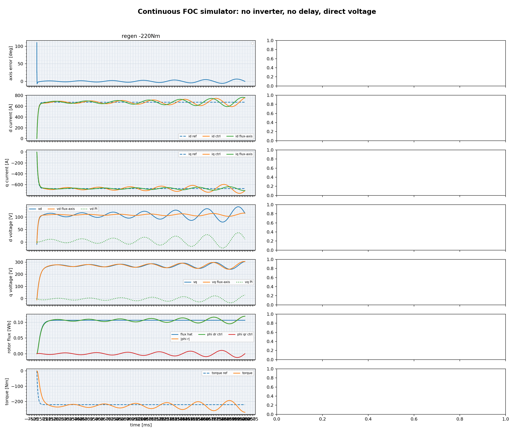

対照として、力行側は同じPI構成でも安定しやすい。

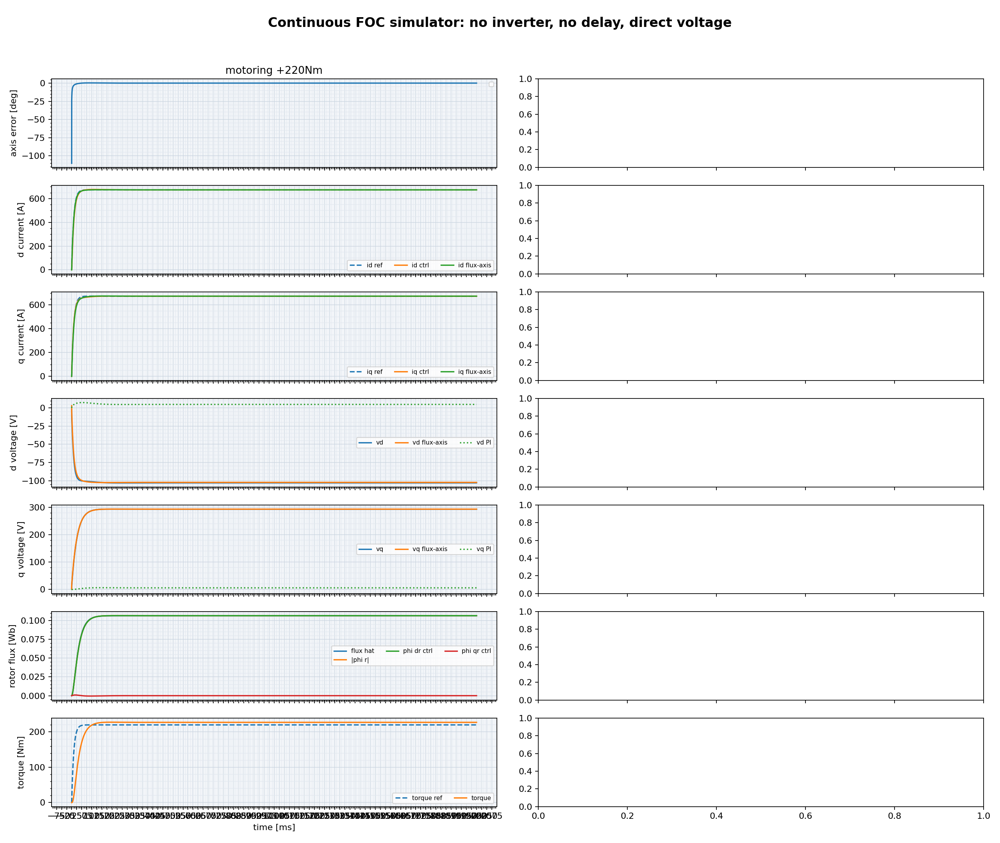

## 2. 軸ずれループによる原因説明

制御角と実ロータ磁束角の差を

```math
\delta
=
\theta_{\mathrm{ctrl}}
-
\theta_{\mathrm{flux}}
```

とする。角速度差から、

```math
\dot{\delta}
=
\omega_{\mathrm{slip,cmd}}
-
\omega_{\mathrm{slip,real}}
```

である。実ロータ磁束基準の滑り周波数は、

```math
\omega_{\mathrm{slip,real}}
=
K\frac{i_{q,\mathrm{actual}}}{\phi_{\mathrm{actual}}},
\qquad
K=\frac{R_r L_m}{L_r}
```

である。

### 2.1 軸ずれから電流誤差への変換

微小な軸ずれがあると、測定dq電流は小角近似で

```math
\begin{aligned}
\Delta i_{d,\mathrm{meas}}
&\simeq
I_{q,\mathrm{actual}}\Delta\delta \\
\Delta i_{q,\mathrm{meas}}
&\simeq
-I_{d,\mathrm{actual}}\Delta\delta
\end{aligned}
```

となる。電流誤差は

```math
e_d=i_d^*-i_{d,\mathrm{meas}},
\qquad
e_q=i_q^*-i_{q,\mathrm{meas}}
```

なので、

```math
\begin{aligned}
\Delta e_d
&\simeq
-I_{q,\mathrm{actual}}\Delta\delta \\
\Delta e_q
&\simeq
+I_{d,\mathrm{actual}}\Delta\delta
\end{aligned}
```

である。したがって

```math
M_{\delta e}
=
\begin{bmatrix}
-I_{q,\mathrm{actual}} \\
I_{d,\mathrm{actual}}
\end{bmatrix}
```

と書ける。ここが力行と回生で符号が変わる第一の場所である。

| 条件 | $I_q$ | $\Delta\delta\rightarrow\Delta e_d$ |
|---|---:|---|
| 力行 | $I_q>0$ | 逆相 |
| 回生 | $I_q<0$ | 同相 |

この符号反転により、同じ軸ずれでも、PIが作る $v_d$ の向きが力行と回生で反転する。

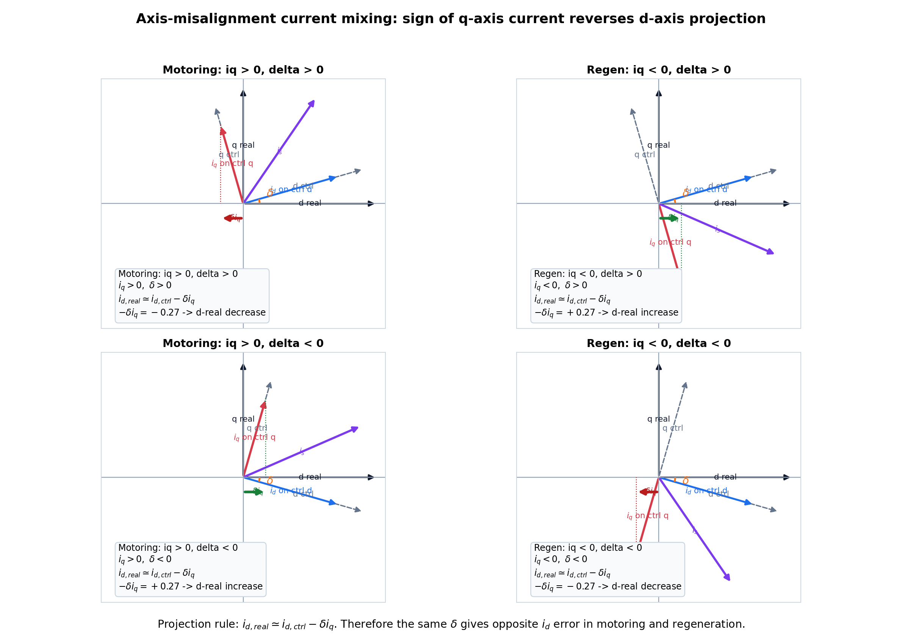

### 2.2 実すべり変動への変換

実滑りの小信号は、動作点まわりの一次近似で

```math
\Delta\omega_{\mathrm{slip,real}}
=
\frac{K}{\Phi}\Delta i_{q,\mathrm{actual}}
-
\frac{K I_{q,\mathrm{actual}}}{\Phi^2}
\Delta\Phi_{\mathrm{actual}}
```

となる。これを

```math
S_{\omega}
=
\begin{bmatrix}
0 &
\frac{K}{\Phi} &
-\frac{K I_{q,\mathrm{actual}}}{\Phi^2}
\end{bmatrix}
```

と書けば、

```math
\Delta\omega_{\mathrm{slip,real}}
=
S_{\omega}
\begin{bmatrix}
\Delta i_d \\
\Delta i_q \\
\Delta\Phi
\end{bmatrix}
```

である。ここでも $I_q$ の符号が入る。

### 2.3 縮約軸ずれループ

電流PIを

```math
C_i(j\omega)
=
K_p\left(1+\frac{K_i}{j\omega}\right)
```

モータの小信号応答を

```math
\begin{bmatrix}
\Delta i_d \\
\Delta i_q \\
\Delta\Phi
\end{bmatrix}
=
G_m(j\omega)
\begin{bmatrix}
\Delta v_d \\
\Delta v_q
\end{bmatrix}
```

とすると、軸ずれから軸ずれへ戻る縮約ループは

```math
L_{\delta}(j\omega)
=
\frac{
-
S_{\omega}
G_m(j\omega)
C_i(j\omega)
M_{\delta e}
}{j\omega}
```

である。最後の $1/(j\omega)$ は $\Delta\dot{\delta}$ から $\Delta\delta$ への角度積分で、常に $-90^\circ$ を加える。

この $L_\delta$ は $\Delta\dot{\delta}=-\Delta\omega_{\mathrm{slip,real}}$ のマイナス符号を含んだ「戻り軸ずれ」である。したがって、軸ずれ状態の自己結合として見たときの特性方程式は

```math
1-L_\delta(s)=0
```

であり、危険点は $L_\delta=+1$、または $D_\delta=1-L_\delta=0$ である。

力行と回生の $L_{\delta}$ は以下である。

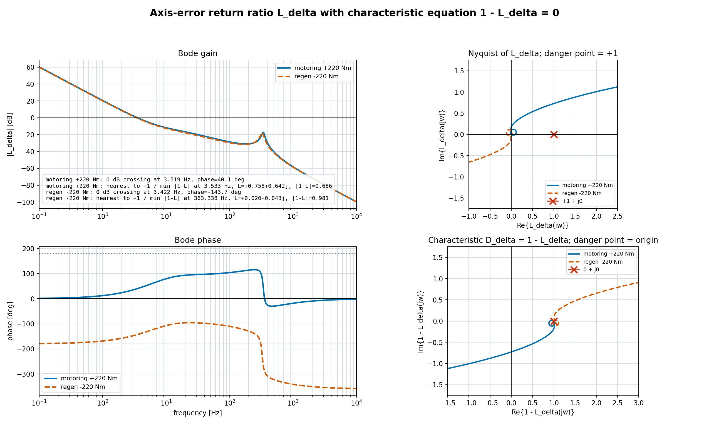

0 dB交差周波数は力行と回生でほぼ同じであり、位相は大きく異なる。しかし、$1-L_\delta=0$ で判定すると、$L_\delta$ の危険点は $-1$ ではなく $+1$ である。

| 運転 | 0 dB交差周波数 | $\angle L_\delta$ | $\min\lvert1-L_\delta\rvert$ | 最近接周波数 |
|---|---:|---:|---:|---:|
| 力行 +220 Nm | 3.519 Hz | +40.1 deg | 0.686 | 3.533 Hz |
| 回生 -220 Nm | 3.422 Hz | -143.7 deg | 0.981 | 363.338 Hz |

この結果から、縮約 $L_\delta$ 単体で「回生だけが不安定側」とは言えない。むしろ $1-L_\delta$ の距離だけを見れば、力行のほうが $+1$ に近い。したがって、この章の $L_\delta$ は不安定判定そのものではなく、軸ずれがどの経路で電流・磁束・滑りへ戻るかを分解するための説明モデルとして扱う。

### 2.4 位相の足し上げ

3.42 Hz付近で、単位軸ずれ $\Delta\delta=1$ を入れた場合の位相を順に追う。

力行では以下になる。

| 段 | 位相 |
|---|---:|
| $\Delta e_d$ | +180 deg |
| $\Delta e_q$ | 0 deg |
| $C_i$ | -78 deg |
| $\Delta v_d$ | +102 deg |
| $\Delta v_q$ | -78 deg |
| $G_m$ 後の $\Delta i_q$ | -76 deg |
| $G_m$ 後の $\Delta\Phi$ | -90 deg |
| $\Delta\omega_{\mathrm{slip,real}}$ | -51 deg |
| $\Delta\dot{\delta}=-\Delta\omega_{\mathrm{slip,real}}$ | +129 deg |
| $\Delta\delta=\Delta\dot{\delta}/j\omega$ | +39 deg |

回生では以下になる。

| 段 | 位相 |
|---|---:|
| $\Delta e_d$ | 0 deg |
| $\Delta e_q$ | 0 deg |
| $C_i$ | -78 deg |
| $\Delta v_d$ | -78 deg |
| $\Delta v_q$ | -78 deg |
| $G_m$ 後の $\Delta i_q$ | +102 deg |
| $G_m$ 後の $\Delta\Phi$ | -90 deg |
| $\Delta\omega_{\mathrm{slip,real}}$ | +126 deg |
| $\Delta\dot{\delta}=-\Delta\omega_{\mathrm{slip,real}}$ | -54 deg |
| $\Delta\delta=\Delta\dot{\delta}/j\omega$ | -144 deg |

したがって、$L_\delta$ の位相が力行と回生で大きく分かれる理由は、以下の順序で説明できる。

1. 回生では $\Delta\delta\rightarrow\Delta e_d$ が同相になる。
2. そのため $\Delta v_d$ と $\Delta v_q$ がほぼ同相で出る。
3. 高速回転座標の $G_m$ により、$\Delta i_q$ が力行とほぼ反対側の位相に出る。
4. $\Delta i_q$ と $\Delta\Phi$ から作る $\Delta\omega_{\mathrm{slip,real}}$ の位相が回生側で $+126^\circ$ になる。
5. $\Delta\dot{\delta}=-\Delta\omega_{\mathrm{slip,real}}$ と角度積分 $1/(j\omega)$ により、最終的な $L_\delta$ が $-144^\circ$ となる。

ただし、この位相差だけから「回生だけ不安定」とは結論できない。$L_\delta$ に $\Delta\dot{\delta}=-\Delta\omega_{\mathrm{slip,real}}$ を含めた定義では、特性方程式は $1-L_\delta=0$ であり、危険点は $+1$ である。この基準では縮約 $L_\delta$ 単体は回生不安定を説明しない。回生だけの不安定判定には、次章のMIMO特性方程式が必要である。

### 2.5 $\Delta i_q$ と $\Delta\Phi$ の寄与

$\Delta i_q$ への寄与を

```math
\Delta i_q
=
G_{qd}\Delta v_d
+
G_{qq}\Delta v_q
```

に分けると以下になる。

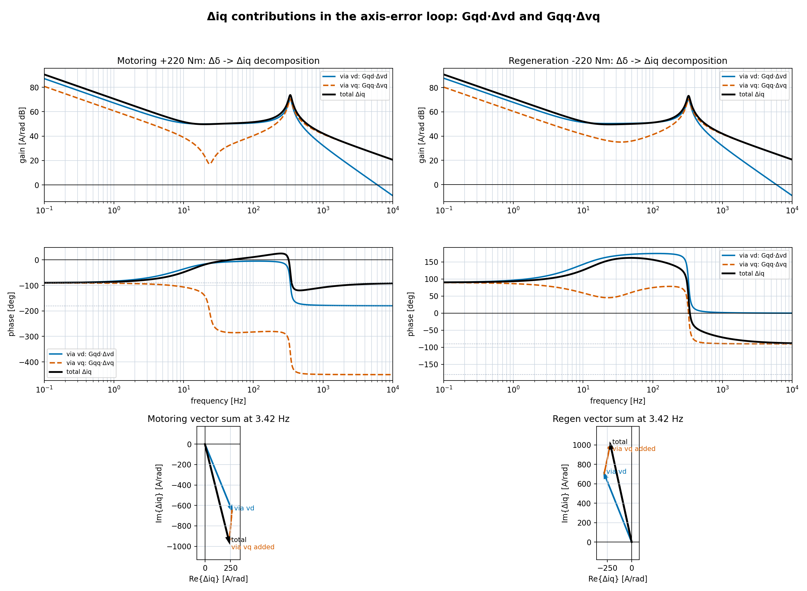

3.42 Hz付近では、

| 運転 | 経路 | 振幅 | 位相 |
|---|---|---:|---:|
| 力行 | $G_{qd}\Delta v_d$ | 700 A/rad | -67.8 deg |
| 力行 | $G_{qq}\Delta v_q$ | 311 A/rad | -94.9 deg |
| 力行 | 合成 | 987 A/rad | -76.1 deg |
| 回生 | $G_{qd}\Delta v_d$ | 758 A/rad | +111.8 deg |
| 回生 | $G_{qq}\Delta v_q$ | 311 A/rad | +78.3 deg |
| 回生 | 合成 | 1030 A/rad | +102.3 deg |

回生では $v_d$ 経由と $v_q$ 経由が相殺せず、ほぼ同方向に加算される。

$\Delta\Phi$ への寄与は以下である。

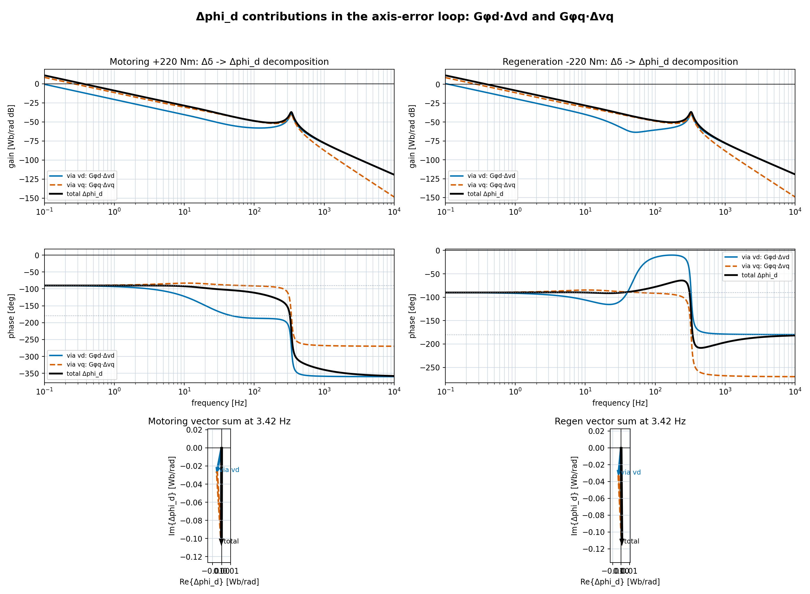

3.42 Hz付近では、

| 運転 | 経路 | 振幅 | 位相 |
|---|---|---:|---:|
| 力行 | $G_{\phi d}\Delta v_d$ | 0.0273 Wb/rad | -100.9 deg |
| 力行 | $G_{\phi q}\Delta v_q$ | 0.0787 Wb/rad | -86.4 deg |
| 力行 | 合成 | 0.105 Wb/rad | -90.1 deg |
| 回生 | $G_{\phi d}\Delta v_d$ | 0.0320 Wb/rad | -95.5 deg |
| 回生 | $G_{\phi q}\Delta v_q$ | 0.0818 Wb/rad | -87.2 deg |
| 回生 | 合成 | 0.114 Wb/rad | -89.5 deg |

$\Delta\Phi$ 応答自体は力行と回生で大きく変わらない。力行/回生差を強く作っているのは、$\Delta i_q$ の位相と、滑り式に含まれる $I_q$ 符号である。

### 2.6 高速ほど悪化する理由

速度を振ると、回生側の交差位相は高回転ほど変化する。これは軸ずれから滑り変動へ至る経路が速度依存であることを示すが、$1-L_\delta=0$ の基準では、この図だけで安定/不安定は判定しない。

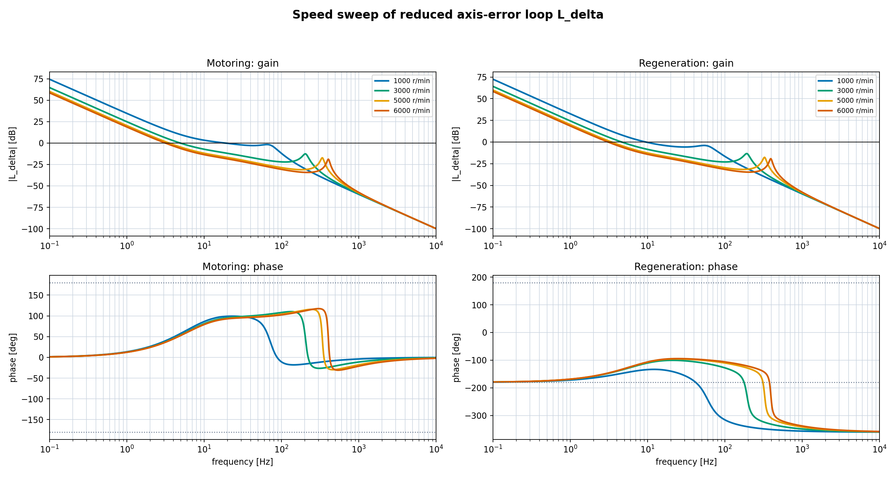

| 運転 | 速度 | 0 dB交差周波数 | 位相 |
|---|---:|---:|---:|
| 力行 | 1000 r/min | 18.6 Hz | +98.6 deg |
| 力行 | 3000 r/min | 4.91 Hz | +53.4 deg |
| 力行 | 5000 r/min | 3.52 Hz | +40.1 deg |
| 力行 | 6000 r/min | 3.15 Hz | +36.3 deg |
| 回生 | 1000 r/min | 9.47 Hz | -134.5 deg |
| 回生 | 3000 r/min | 4.62 Hz | -135.4 deg |
| 回生 | 5000 r/min | 3.42 Hz | -143.8 deg |
| 回生 | 6000 r/min | 3.09 Hz | -146.6 deg |

この縮約ループだけでは不安定を最終判定しない。$L_\delta$ の定義にマイナス符号を含めた場合、判定すべき特性方程式は $1-L_\delta=0$ であり、危険点は $+1$ であるためである。速度依存の最終判定は、3章のMIMO特性方程式で行う。

## 3. MIMO特性方程式による不安定周波数応答の再現

$L_\delta$ は、現象を理解するために軸ずれループを1本へ縮約したモデルである。実際の電流制御は $d/q$ の2入力2出力系なので、安定性はMIMO return ratioで見る必要がある。

PI入力でループを切り、PI出力電圧から検出dq電流までを

```math
\Delta i_{\mathrm{meas}}(s)
=
G_i(s)\Delta v_{\mathrm{PI}}(s)
```

と定義する。$G_i(s)$ には、モータ磁束状態、磁束推定、滑り計算、非干渉項、制御角、dq座標変換を含める。

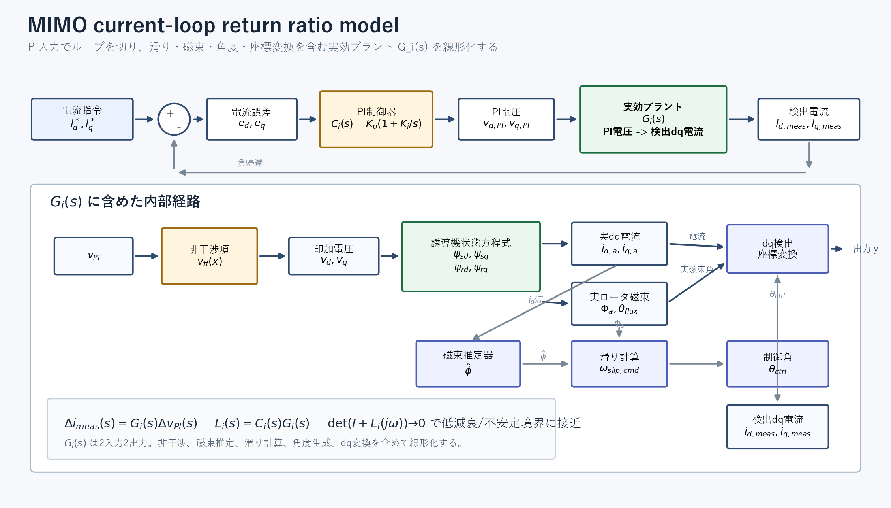

電流PIを

```math
C_i(s)=K_p\left(1+\frac{K_i}{s}\right)
```

とすると、MIMO return ratioは

```math
L_i(s)=C_i(s)G_i(s)
```

である。閉ループの自由振動条件は

```math
(I+L_i(s))\Delta i=0
```

であり、非ゼロ解が存在する条件は

```math
\det(I+L_i(s))=0
```

である。したがって、MIMOの特性方程式は

```math
\boxed{\det(I+L_i(s))=0}
```

である。

`det(I+L_i)` を直接ナイキスト表示する場合、危険点は $-1$ ではなく原点である。

### 3.1 力行/回生比較

5000 r/min、`id_ref` 起点滑り、磁束フィードバック非干渉あり条件で、力行と回生を比較すると以下になる。

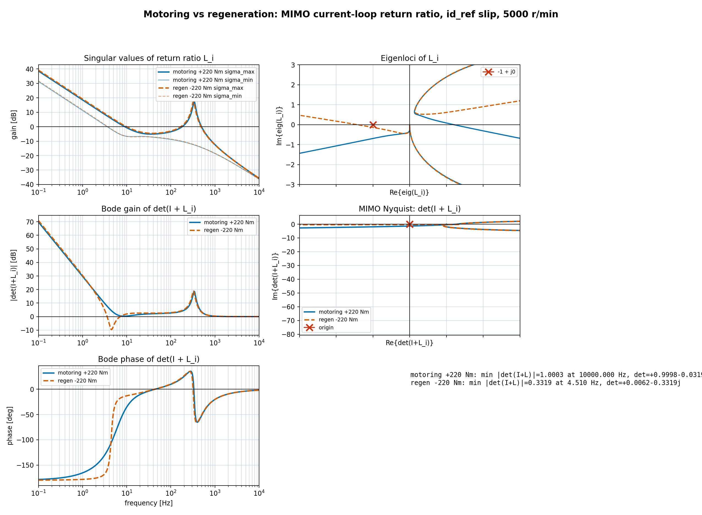

| 運転状態 | $\min\lvert\det(I+L_i)\rvert$ | 周波数 | 判定 |
|---|---:|---:|---|
| 力行 +220 Nm | 1.000 | 10000 Hz | 低周波の危険な谷なし |
| 回生 -220 Nm | 0.332 | 4.51 Hz | 4.5 Hz付近で原点へ接近 |

これは、縮約 $L_\delta$ だけでは説明できなかった「回生だけ低周波モードが危険化する」という差を、MIMO特性方程式では再現できていることを示す。

### 3.2 滑り計算の磁束入力による差

滑り計算に使う磁束を `id_ref` 起点から、`id_feedback` 起点、さらに実ロータ磁束へ近づけると、低周波の危険な谷は小さくなる。

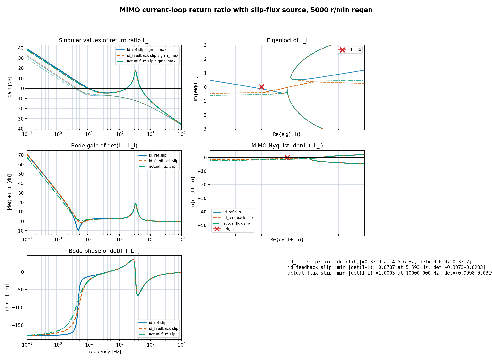

| 滑り計算の磁束 | $\min\lvert\det(I+L_i)\rvert$ | 周波数 |
|---|---:|---:|
| $i_{d,\mathrm{ref}}$ 起点 | 0.332 | 4.52 Hz |
| $i_{d,\mathrm{feedback}}$ 起点 | 0.879 | 5.59 Hz |
| 実ロータ磁束 | 1.000 | 10000 Hz |

`id_ref` 起点では、実磁束が変動しても滑り指令へ戻らない。一方、`id_feedback` または実磁束を使うと、実磁束変動が滑り指令側へ戻るため、

```math
\omega_{\mathrm{slip,cmd}}
\simeq
\omega_{\mathrm{slip,real}}
```

に近づく。これは位相進み補償ではなく、滑り誤差を作る低周波ゲインを構造的に下げる効果である。

### 3.3 速度依存

`id_ref` 起点滑りのまま速度を振ると、高速ほど低周波の谷が深くなる。

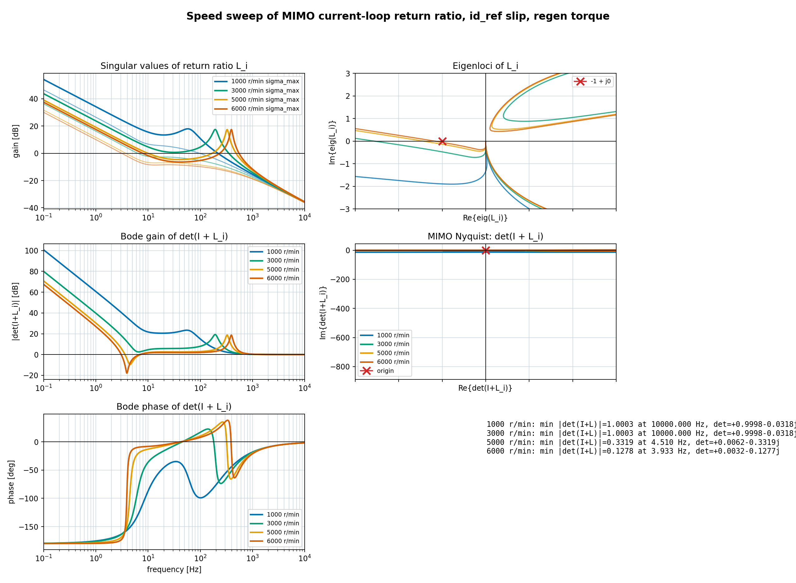

| 速度 | $\min\lvert\det(I+L_i)\rvert$ | 周波数 |
|---:|---:|---:|
| 1000 r/min | 1.000 | 10000 Hz |
| 3000 r/min | 1.000 | 10000 Hz |
| 5000 r/min | 0.332 | 4.51 Hz |
| 6000 r/min | 0.128 | 3.93 Hz |

これは「速度が高いほど不安定化しやすい」という観測と一致する。

### 3.4 電流PIゲイン依存

`id_ref` 起点滑り、5000 r/min回生で電流PIの比例ゲインを振ると以下になる。

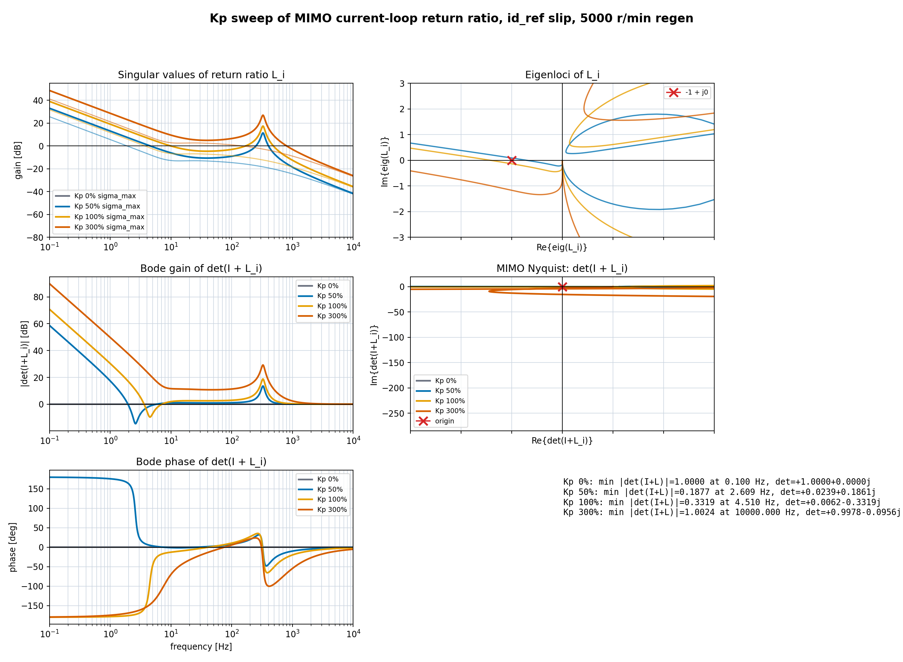

| $K_p$倍率 | $\min\lvert\det(I+L_i)\rvert$ | 周波数 |
|---:|---:|---:|
| 0% | 1.000 | 0.100 Hz |
| 50% | 0.188 | 2.61 Hz |
| 100% | 0.332 | 4.51 Hz |
| 300% | 1.002 | 10000 Hz |

実験で「電流制御ゲインを0、または3000 rad/s相当にすると安定化する」という傾向は、この図で説明できる。中途半端なゲインでは数Hz帯のMIMO特性方程式が原点へ近づき、危険な低周波モードを作る。一方、ゲイン0ではPIによる電圧応答が軸ずれ経路へ戻らず、非常に高いゲインでは低周波の電流偏差を強く抑え込む。

### 3.5 固有値による確認

全閉ループ状態を線形化して固有値を見ると、非干渉なしの連続系では回生だけ右半平面極が出る。

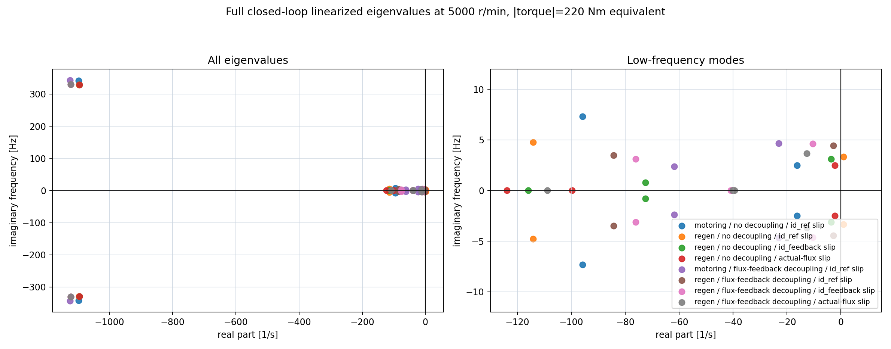

代表値は以下である。

| 条件 | 支配極 | 周波数 | 判定 |
|---|---:|---:|---|
| 力行 / no decoupling / id_ref slip | $-16.35 \pm j15.53$ | 2.47 Hz | 安定 |
| 回生 / no decoupling / id_ref slip | $+0.863 \pm j20.89$ | 3.33 Hz | 不安定 |
| 回生 / no decoupling / id_feedback slip | $-3.70 \pm j19.65$ | 3.13 Hz | 安定化 |
| 回生 / no decoupling / actual flux slip | $-2.29 \pm j15.54$ | 2.47 Hz | 安定化 |

非干渉を含めた簡略モデルでは右半平面極までは出ないが、回生側の減衰は力行より小さく、高速ほど安定余裕が小さい。

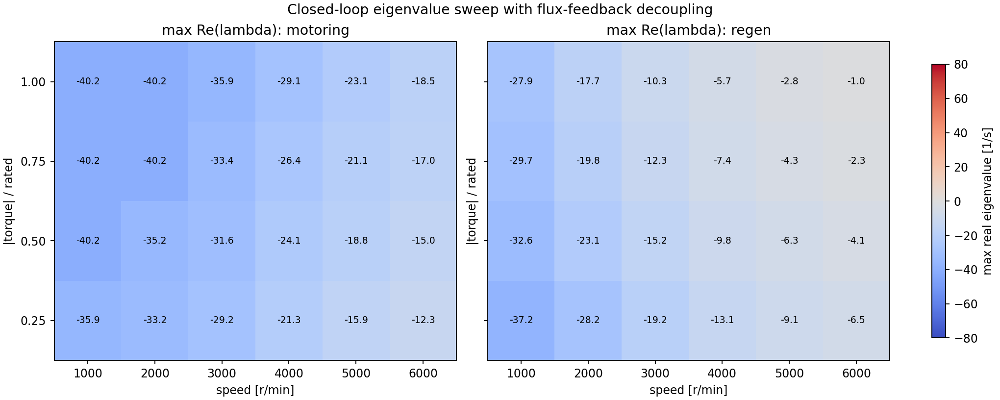

## 4. 対策

### 4.1 滑り計算を指令磁束だけに依存させない

最も本質的な対策は、滑り計算の磁束を `id_ref` 起点だけにしないことである。

推奨順は以下。

| 対策 | 効果 |
|---|---|
| 実ロータ磁束を滑り計算に使う | 最も直接的。実すべりと指令すべりが一致しやすい |
| $i_d$ フィードバックから磁束推定する | 実機で実装しやすい。低周波滑り誤差ゲインを下げる |
| $i_q$ フィードバックを滑り分子に混ぜる | $i_q$ ずれによる滑り誤差を減らす |

`id_feedback` は位相を進ませる補償ではない。磁束推定器は

```math
\frac{\hat{\phi}}{i_{d,\mathrm{fb}}}
=
\frac{L_m}{1+sT_r}
```

であり、単体では一次遅れである。それでも安定化する理由は、実 $i_d$ 変動を滑り指令側へ戻すことで、

```math
\omega_{\mathrm{slip,cmd}}
-
\omega_{\mathrm{slip,real}}
```

の低周波ゲインを下げるためである。

### 4.2 電流PI設計

`id_ref` 起点滑りを使い続ける場合、問題となる数Hz帯で電流偏差を十分に抑える必要がある。低周波電流プラントを

```math
P_{\mathrm{current}}(s)
\simeq
\frac{1}{\sigma L_s s+R_s}
```

と近似すると、問題周波数 $\omega_{\mathrm{bad}}$ で

```math
\left|
C_i(j\omega_{\mathrm{bad}})
P_{\mathrm{current}}(j\omega_{\mathrm{bad}})
\right|
\ge
L_{\mathrm{req}}
```

を満たすようにする。

低周波でI項支配なら、

```math
C_i(j\omega)
\simeq
\frac{K_pK_i}{j\omega}
```

なので、

```math
K_i
\ge
\frac{
L_{\mathrm{req}}
\omega_{\mathrm{bad}}
R_s
}{K_p}
```

となる。ただし、PIゲインだけで押さえ込む方法は、モータ定数誤差、電圧制限、検出遅れ、ノイズに弱い。設計上は、滑り計算側にフィードバックを入れて低周波正帰還経路を構造的に弱める方が妥当である。

### 4.3 実機/Simulinkでの確認方法

不安定動作点では、閉ループのまま長時間のsinestream/chirpを入れると動作点が崩れる。そのため、測定時は電流PIループを開いて、PI出力電圧相当へ小信号を注入する。

```text
vd_PI = vdPI0 + d_inj
vq_PI = vqPI0 + q_inj

入力: d_inj, q_inj
出力: id_meas, iq_meas
```

これにより

```math
G_i(j\omega)
=
\begin{bmatrix}
i_d/v_d & i_d/v_q \\
i_q/v_d & i_q/v_q
\end{bmatrix}
```

を測定できる。その後、MATLAB上で

```math
L_i(j\omega)
=
C_i(j\omega)G_i(j\omega)
```

を作り、

```math
\det(I+L_i(j\omega))
```

を評価すればよい。

## 5. まとめ

本現象の説明は以下の流れで整理できる。

1. 回生では $I_q<0$ となり、軸ずれからd軸電流誤差への符号が力行と反転する。
2. その結果、PIが作る $v_d/v_q$ の位相関係が変わる。
3. 高速回転座標のモータ応答 $G_m$ を通ると、回生側では $\Delta i_q$ と $\Delta\Phi$ から作られる実すべり変動の位相が力行と大きく異なる。
4. ただし、$\Delta\dot{\delta}=-\Delta\omega_{\mathrm{slip,real}}$ を含めた縮約 $L_\delta$ では特性方程式が $1-L_\delta=0$ となるため、$L_\delta$ 単体では回生だけの不安定判定はできない。
5. MIMO特性方程式 $\det(I+L_i)=0$ で見ると、回生だけ4.5 Hz付近に低周波の谷が出る。
6. 滑り計算に実磁束または $i_d$ フィードバックを入れると、この低周波の谷が浅くなり、安定方向へ移る。

したがって、問題の本質は「電流PIが悪い」ではなく、**指令ベース滑りと実磁束の切り離しにより、電流PIを含むMIMO内部結合が数Hz帯のモードを励起すること**である。軸ずれ縮約モデルは、その内部結合を理解するための説明モデルであり、安定判定はMIMO特性方程式で行う。

## 付録A. 滑り周波数小信号式の導出

実滑りを

```math
\omega_{\mathrm{slip,real}}
=
K\frac{i_q}{\Phi}
```

とする。動作点を

```math
i_q=I_q,
\qquad
\Phi=\Phi_0
```

とし、微小変動を

```math
i_q=I_q+\Delta i_q,
\qquad
\Phi=\Phi_0+\Delta\Phi
```

と置く。

多変数テイラー展開の一次項までを取ると、

```math
\Delta\omega_{\mathrm{slip,real}}
\simeq
\left.
\frac{\partial}{\partial i_q}
K\frac{i_q}{\Phi}
\right|_0
\Delta i_q
+
\left.
\frac{\partial}{\partial \Phi}
K\frac{i_q}{\Phi}
\right|_0
\Delta\Phi
```

である。偏微分は

```math
\left.
\frac{\partial}{\partial i_q}
K\frac{i_q}{\Phi}
\right|_0
=
\frac{K}{\Phi_0}
```

```math
\left.
\frac{\partial}{\partial \Phi}
K\frac{i_q}{\Phi}
\right|_0
=
-
\frac{K I_q}{\Phi_0^2}
```

なので、

```math
\Delta\omega_{\mathrm{slip,real}}
\simeq
\frac{K}{\Phi_0}\Delta i_q
-
\frac{K I_q}{\Phi_0^2}\Delta\Phi
```

を得る。

ここで重要なのは、必要なのは

```math
K\Delta\left(\frac{i_q}{\Phi}\right)
```

であって、

```math
K\frac{\Delta i_q}{\Delta\Phi}
```

ではないことである。後者は変化量どうしの比であり、滑り周波数の小信号変化ではない。

## 付録B. 数値線形化と周波数応答

非線形モデルを

```math
\dot{x}=f(x,u)
```

とする。動作点 $(x_0,u_0)$ まわりで

```math
x=x_0+\Delta x,
\qquad
u=u_0+\Delta u
```

と置き、一次テイラー展開すると

```math
\Delta\dot{x}
=
A\Delta x+B\Delta u
```

となる。ここで

```math
A=
\left.
\frac{\partial f}{\partial x}
\right|_{x_0,u_0},
\qquad
B=
\left.
\frac{\partial f}{\partial u}
\right|_{x_0,u_0}
```

である。出力を

```math
\Delta y=C\Delta x+D\Delta u
```

とすれば、周波数応答は

```math
G(j\omega)
=
C(j\omega I-A)^{-1}B+D
```

で求められる。

今回のMIMO return ratioでは、入力をPI出力電圧、出力を検出dq電流として

```math
G_i(j\omega)
=
\frac{
\begin{bmatrix}
\Delta i_d \\
\Delta i_q
\end{bmatrix}
}{
\begin{bmatrix}
\Delta v_{d,\mathrm{PI}} \\
\Delta v_{q,\mathrm{PI}}
\end{bmatrix}
}
```

を求め、その後

```math
L_i(j\omega)
=
C_i(j\omega)G_i(j\omega)
```

として評価した。
